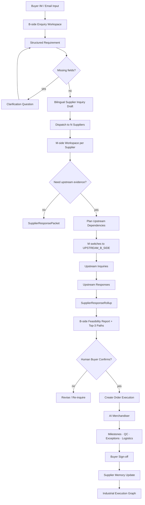

# Giraffe Agent

> Digital procurement and order-execution worker for industrial trade.  
> AI Buyer + AI Merchandiser + Neutral Actor Model + Industrial Execution Graph.

[](https://www.python.org/)
[](https://fastapi.tiangolo.com/)
[](https://docs.pydantic.dev/)
[](https://docs.astral.sh/uv/)
[](LICENSE)

---

## What Is Giraffe Agent?

Giraffe Agent is an open-core, project-aware, role-switching agent framework for industrial procurement and order execution.

It is designed for SME buyers, manufacturers, merchandisers, factories, subcontractors, logistics partners, and supplier networks that still coordinate real trade through IM, email, spreadsheets, calls, screenshots, drawings, and fragmented supplier replies.

Giraffe Agent turns that messy execution layer into structured, auditable, human-confirmable workflow state.

It is not a CRM, ERP, marketplace, supplier directory, or chatbot.

It is a **digital procurement and order-execution worker** that sits inside existing communication channels and helps human legal parties move from inquiry to confirmed order to production execution.

Giraffe Agent has two primary digital worker roles:

| Worker role | Phase | Main responsibility |
|---|---:|---|
| **AI Buyer** | Pre-confirmation | Structure buyer requirements, clarify missing fields, draft supplier inquiries, collect replies, simulate feasible delivery paths |
| **AI Merchandiser** | Post-confirmation | Track order acknowledgement, production milestones, QC/media confirmation, exceptions, logistics handover, buyer sign-off, supplier memory |

Together, they produce an **Industrial Execution Graph**: an append-only execution record of what actually happened across the order lifecycle.

---

## The New Category

Classical procurement tools assume the buyer already has clean data, known suppliers, formal RFQs, fixed counterparties, and a stable system interface.

Real industrial procurement is different:

- requirements arrive as incomplete IM messages;
- suppliers reply in different formats;
- the same manufacturer can be a supplier to one party and a buyer to another;
- upstream material, trim, subcontracting, packaging, and logistics dependencies are often hidden;
- delivery promises are not enough — execution evidence matters;
- humans still carry legal responsibility for commercial decisions.

Giraffe Agent creates a new execution layer:

> **A digital worker that converts IM/email-based industrial trade into structured, role-aware, evidence-backed order execution.**

The core unit is not a dashboard.  
The core unit is an **AI execution worker** operating on a project graph.

---

## Legal and Operating Boundary

Giraffe Agent does not replace the legal parties to a transaction.

It does not become the buyer, seller, manufacturer, freight forwarder, payment obligor, insurer, bank, or contracting party.

Human users and their legal entities remain responsible for:

- approving supplier inquiries;
- confirming quotations;
- selecting delivery paths;
- accepting production schedules;
- approving order commitments;
- releasing payments;
- signing contracts;
- accepting risk.

Giraffe Agent assists by producing:

- structured requirements;
- clarification questions;
- bilingual inquiry drafts;
- supplier response packets;
- delivery feasibility reports;
- evidence-backed Top-3 options;
- production and QC milestone records;
- logistics updates;
- exception reports;
- supplier memory updates;
- append-only execution events.

High-stake actions must remain human-confirmed.

---

## Core Product Thesis

Giraffe Agent is built around five product principles.

### 1. Conversation is the real interface

Industrial trade does not start in a clean SaaS form.

It starts in WeChat, WhatsApp, email, phone notes, drawings, screenshots, PDFs, and informal buyer messages.

Giraffe Agent is designed to work with IM/email-first workflows through an OpenClaw-compatible skill layer and channel adapters.

### 2. Roles are contextual, not fixed

The same company can be:

- a supplier to the original buyer;
- a buyer to its own upstream supplier;
- a coordinator for subcontracting, packaging, or logistics;
- a merchandiser after the order is confirmed.

Giraffe Agent therefore uses a Neutral Actor Model instead of hardcoding B-side and M-side as fixed identities.

### 3. Pre-confirmation and post-confirmation are one execution chain

Most tools stop at sourcing or quotation.

Real orders continue through acceptance, production, QC, media confirmation, logistics handover, tracking, exceptions, buyer sign-off, and supplier memory.

Giraffe Agent connects AI Buyer and AI Merchandiser into one project-aware execution lifecycle.

### 4. Evidence matters more than promises

Supplier-stated lead time is preserved as evidence but not trusted blindly.

Delivery feasibility is calculated from full path dependencies:

- material;
- trim;
- packaging material;
- subcontracting;
- production;
- QC;
- packaging;
- logistics.

Missing fields become risk flags, not fake certainty.

### 5. The execution record must be append-only

Industrial execution needs auditability.

Giraffe Agent records state transitions in an append-only Industrial Execution Graph.

Events are appended, not rewritten.

---

## Core Concept: Neutral Actor Model

> Do not treat B-side and M-side as permanent identities.

An actor's role is contextual. It depends on the project, procurement edge, and counterparty.

The same company may be:

| Role | Meaning |
|---|---|
| `MAIN_M_SIDE` | Main supplier to the original buyer |
| `UPSTREAM_B_SIDE` | Same manufacturer acting as buyer to its own upstream suppliers |

Example:

```text
Buyer B  →  Manufacturer M
M is MAIN_M_SIDE to B.

Manufacturer M  →  Fabric Supplier F1
M is UPSTREAM_B_SIDE to F1.
```

Every workflow is project-aware and edge-aware.

This enables recursive supply-chain execution instead of a flat buyer-supplier form.

---

## Example: 10,000-Shirt Sourcing Project

A buyer sends an IM message:

```text
Need 10,000 men's cotton shirts.
Target ship date: end of next month.
Need quote, lead time, fabric options, packaging, and shipping.
```

Giraffe Agent does not simply answer.

It starts a structured execution workflow.

### AI Buyer

1. Parses buyer intent.
2. Extracts quantity, product, deadline, missing specs.
3. Asks clarification questions if required.
4. Drafts bilingual supplier inquiries.
5. Sends inquiries to multiple M-side suppliers.
6. Normalizes supplier replies.
7. Builds delivery paths.
8. Produces Top-3 feasible options for human approval.

### Role-Switching Agent

If a manufacturer needs upstream fabric, trim, packaging, subcontracting, or logistics confirmation:

1. The manufacturer switches into `UPSTREAM_B_SIDE`.
2. The agent drafts upstream inquiries.
3. Upstream supplier replies are parsed.
4. Evidence is rolled up into a supplier-facing response packet.
5. The final buyer-facing quotation is backed by upstream evidence.

### AI Merchandiser

After buyer confirmation:

1. Creates order execution state.
2. Tracks supplier acknowledgement.
3. Tracks production milestones.
4. Collects QC/media confirmation.
5. Reports exceptions.
6. Ingests logistics updates.
7. Records buyer sign-off.
8. Updates Supplier Memory.

---

## Architecture

```text
┌─────────────────────────────────────────────────────────────────────┐
│ IM / OpenClaw Layer                                                 │
│   OpenClaw skill manifest · WeChat / WhatsApp / Web / Email adapters│
├─────────────────────────────────────────────────────────────────────┤
│ Conversation Orchestration Layer                                    │
│   Session resolution · Role-aware IM router · Intent routing        │
├─────────────────────────────────────────────────────────────────────┤
│ Workflow Layer                                                       │
│   AI Buyer: requirement → inquiry → feasibility                     │
│   Supplier Response Agent                                           │
│   Role-Switching Procurement Agent                                  │
│   Professional Free CAD↔CNC matching                                │
│   AI Merchandiser: milestones · QC · exceptions · logistics         │
│   Cainiao-like logistics ingestion                                  │
├─────────────────────────────────────────────────────────────────────┤
│ Bridge Layer                                                        │
│   Inquiry Dispatcher · Response Bridge · Order Bridge               │
├─────────────────────────────────────────────────────────────────────┤
│ Persistence Layer                                                   │
│   SQLite local · PostgreSQL production-portable                     │
│   Actors · Projects · Edges · RoleContexts · Requirements           │
│   Inquiries · Responses · Rollups · Milestones · Shipments          │
├─────────────────────────────────────────────────────────────────────┤
│ Industrial Execution Graph                                          │
│   Append-only ExecutionEvent log + procurement_edges                │
└─────────────────────────────────────────────────────────────────────┘
```

---

## End-to-End Flow



---

## Main Modules

| # | Module | Phase | Purpose |
|---:|---|---|---|
| 1 | AI Buyer | Pre-confirmation | Structure requirements, draft bilingual inquiries, run delivery feasibility simulation |
| 2 | Supplier Response Agent | Pre-confirmation | M-side intake, normalization, `SupplierResponsePacket` |
| 3 | Role-Switching Procurement Agent | Pre-confirmation | Recursive `UPSTREAM_B_SIDE` logic, upstream inquiry builder, option engine, approval gate |
| 4 | Professional Free CAD↔CNC Matching | Pre-confirmation | CAD Requirement Packet, Capability Fit Report, machine profile matching |
| 5 | AI Merchandiser | Post-confirmation | Production milestones, QC/media confirmation, exception reporting, logistics handover, buyer sign-off |
| 6 | Send/Receive Role Switching | Post-confirmation | M-side send/receive mode transitions |
| 7 | Cainiao-like Logistics Ingestion | Post-confirmation | Carrier API normalization and shipment tracking ingestion |
| 8 | Database Layer | Cross-cutting | SQLAlchemy models, Alembic migrations, SQLite→PostgreSQL portability |
| 9 | Dynamic Self-Learning Schema | Cross-cutting | AI observes and proposes new fields without altering physical tables at runtime |
| 10 | Industrial Execution Graph | Cross-cutting | Append-only event log for every state transition across all actors |

---

## Current MVP Scope

The current repository is an MVP implementation.

It is designed to prove the execution model, not to claim production completeness.

Implemented MVP capabilities include:

- FastAPI application entry point;
- OpenClaw-compatible skill invocation route;
- B-side enquiry workspace;
- requirement structuring;
- bilingual supplier inquiry drafting;
- supplier workspace creation;
- B/M inquiry dispatch;
- M-side supplier response handling;
- response bridge back to B-side;
- role-switching procurement logic;
- CAD↔CNC Professional Free matching;
- order execution creation;
- AI Merchandiser workflow;
- production, QC, and logistics updates;
- Cainiao-like logistics ingestion;
- SQLAlchemy models;
- Alembic migration support;
- SQLite local mode;
- PostgreSQL-portable model design;
- append-only execution events;
- reproducible E2E scripts.

Production hardening still requires:

- real LLM provider integration;
- authentication and authorization;
- real IM/webhook adapters;
- real email connectors;
- production PostgreSQL deployment;
- observability;
- security hardening;
- UI;
- deployment packaging;
- enterprise permission model;
- commercial-grade audit controls.

---

## Quick Start

### Prerequisites

- Python 3.11+
- [`uv`](https://docs.astral.sh/uv/) package manager

### Setup

```bash
git clone https://github.com/GiraffeTechnology/giraffe-agent.git
cd giraffe-agent

uv sync

uv run python scripts/init_db.py
uv run python scripts/seed_mvp_data.py

uv run uvicorn api.main:app --reload
```

The API will be available at:

```text
http://localhost:8000
```

Interactive docs:

```text
http://localhost:8000/docs
```

---

## E2E Verification

Run the verification suite after setup.

### B/M-side DB Integration Baseline

```bash
GIRAFFE_DB_MODE=off uv run python run_bm_e2e_with_db.py

GIRAFFE_DB_MODE=on GIRAFFE_DB_URL=sqlite:///./test.db uv run python build_schema.py
GIRAFFE_DB_MODE=on GIRAFFE_DB_URL=sqlite:///./test.db uv run python run_bm_e2e_with_db.py

uv run python verify_integration.py --db sqlite:///./test.db --runs 5
```

Expected successful baseline:

```text
run 1/5: PASS  run 2/5: PASS  run 3/5: PASS  run 4/5: PASS  run 5/5: PASS
PRAGMA integrity_check: ok
PRAGMA foreign_key_check: ok
Result: 5/5 passed
```

### Lead Time Path Model

The B-side feasibility engine uses a path-based lead time calculation.

Key rules:

- Material, trim, packaging-material, and subcontract dependencies run in parallel, so use `max()`.
- Production, QC, packaging, and logistics run sequentially, so use `sum()`.
- Supplier-stated lead time is preserved as evidence but not trusted blindly.
- Missing fields create `risk_flags`; never use fake sentinel values such as `999`.

Run:

```bash
uv run python scripts/run_lead_time_model_demo.py
```

Expected output:

```text
LEAD TIME MODEL DEMO: PASS
```

### MVP E2E Scripts

```bash
uv run python scripts/run_db_smoke_test.py
uv run python scripts/run_bm_e2e_mvp.py
uv run python scripts/run_role_switching_mvp.py
uv run python scripts/run_mside_professional_free_cad_cnc_mvp.py
uv run python scripts/run_mside_send_receive_role_switch_test.py
uv run python scripts/run_merchandiser_e2e_mvp.py
uv run python scripts/run_logistics_cainiao_like_api_mvp.py
uv run python scripts/run_integrated_post_confirmation_mvp.py
uv run python scripts/run_lead_time_model_demo.py
```

### Unit Tests

```bash
uv run pytest
```

---

## API Overview

The FastAPI application entry point is:

```text
api.main:app
```

The root `main.py` is only a lightweight helper for local developer guidance.

Primary route groups include:

| Route | Purpose |
|---|---|
| `GET /health` | Health check |
| `POST /api/skill/invoke` | OpenClaw skill invocation |
| `POST /api/b-side/workspaces` | Create a B-side Enquiry Workspace |
| `POST /api/b-side/workspaces/{id}/structure-requirement` | Structure raw buyer requirement |
| `POST /api/b-side/workspaces/{id}/draft-inquiry` | Draft bilingual supplier inquiry |
| `POST /api/b-side/workspaces/{id}/run-feasibility` | Run delivery feasibility simulation |
| `POST /api/m-side/suppliers` | Create supplier profile |
| `POST /api/bm/dispatch-inquiry` | Dispatch inquiry to supplier workspaces |
| `POST /api/bm/push-response-to-b-side` | Push M-side response back to B-side |
| `POST /api/bm/create-order-execution` | Create order execution from selected delivery path |
| `POST /api/m-side/orders/{id}/acknowledge` | Supplier order acknowledgement |
| `POST /api/m-side/orders/{id}/production-update` | Submit production update |
| `POST /api/m-side/orders/{id}/qc-update` | Submit QC confirmation |
| `POST /api/m-side/orders/{id}/logistics-update` | Submit logistics handover |

Full interactive documentation is available at `/docs` when the server is running.

---

## Repository Structure

```text
giraffe-agent/
├── api/                        # FastAPI application
│   └── main.py
├── src/
│   ├── b_side/                 # AI Buyer
│   ├── m_side/                 # Supplier Response Agent, Role-Switching Agent, AI Merchandiser
│   │   ├── professional_free/  # CAD↔CNC matching
│   │   ├── rollup/             # SupplierResponseRollup builder
│   │   └── upstream/           # Upstream inquiry builder, option engine, approval gate
│   ├── bm_bridge/              # Inquiry dispatcher, response bridge, order bridge
│   ├── channels/               # WeChat / WhatsApp / Web / Email adapters
│   ├── openclaw_skill/         # OpenClaw skill manifest and router
│   ├── actors/                 # Neutral actor model, role resolver
│   ├── projects/               # Project graph
│   ├── core_schema/            # Pydantic types for B-side and M-side
│   ├── merchandiser/           # Post-confirmation execution engine
│   ├── logistics/              # Cainiao-like logistics ingestion
│   └── db/                     # SQLAlchemy models, mixins, Alembic config
├── scripts/                    # Setup, seed, and E2E verification scripts
├── alembic/                    # Database migrations
├── docs/                       # Product requirement documents
├── data/                       # Runtime workspace files and event log
├── openclaw/                   # OpenClaw skill packaging
├── PATENT_NOTICE.md
├── LICENSE_NOTICE.md
├── LICENSE
└── pyproject.toml
```

---

## Design Constraints

These invariants are non-negotiable.

### Neutral Actor Model

Never hardcode B-side or M-side as fixed actor identities.

Roles are contextual per `Project` and `ProcurementEdge`.

### Human Confirmation

Giraffe Agent must not create commercial commitments without human approval.

High-stake actions require explicit confirmation.

### No Faked Data

If parsing is uncertain, surface a clarification question or risk flag.

Never invent supplier data, prices, dates, capacity, material availability, logistics status, CAD properties, or buyer approvals.

### Append-Only Execution Graph

`execution_events` must never be updated or deleted.

State changes are appended.

### Dynamic Schema Rule

AI may observe and propose new fields.

It must not directly alter physical database table definitions at runtime.

### No Enterprise CAP in MVP

The Professional Free tier explicitly has no file encryption, dynamic watermarking, secure viewer, or no-download rooms.

Do not add Enterprise CAP features to the MVP tier.

---

## Tech Stack

| Component | Choice |
|---|---|
| Language | Python 3.11+ |
| API framework | FastAPI + Uvicorn |
| Data validation | Pydantic v2 |
| ORM | SQLAlchemy 2.x |
| Migrations | Alembic |
| Local database | SQLite |
| Production-portable database | PostgreSQL |
| Package manager | `uv` |
| Primary channels | OpenClaw, WeChat, WhatsApp, Email, Web fallback |

---

## How to Contribute

Giraffe Agent is an open MVP.

Good contribution paths include:

### Backend / Core

- Replace rule-based stubs with real LLM provider integrations.
- Extend requirement structuring with confidence scoring.
- Improve feasibility ranking and path comparison.
- Add richer Industrial Execution Graph query and replay APIs.
- Implement dynamic schema observation and proposal logic.

### Channels

- Wire real WeChat, WhatsApp, and email webhook adapters.
- Improve OpenClaw-compatible skill responses.
- Add channel-specific human confirmation flows.

### Matching and Intelligence

- Improve CAD↔CNC capability scoring.
- Add supplier memory retrieval into feasibility simulation.
- Add evidence scoring for supplier replies.
- Improve risk flag generation for missing or inconsistent fields.

### Production / Ops

- Migrate local workflows to PostgreSQL.
- Add authentication middleware.
- Add tenant/project permission model.
- Add observability and audit logs.
- Build buyer-facing and supplier-facing UI.

### Testing

- Add unit tests for individual modules.
- Add regression tests for role-switching edge cases.
- Add golden-path tests for multi-supplier inquiry flows.
- Add post-confirmation exception scenario tests.

Before submitting a PR, run the E2E suite and make sure the relevant scripts still pass.

---

## Patent Notice and License

This repository is released under the Apache-2.0 software license.

Certain workflows, system logic, role-based participant coordination mechanisms, and multi-party C2M / order execution workflows in this project may be covered by patents owned by Giraffe Technology Holding Limited.

| Jurisdiction | Patent |
|---|---|
| China | ZL 2023 1 1645939.9 / CN 117670482 B |
| Japan | P7644545 / 特許第7644545号 |

Giraffe Technology Holding Limited grants a Global Free Patent License to:

- individuals;
- developers;
- researchers;
- students;
- SMEs for their own procurement, production coordination, and sourcing;
- educational institutions for teaching and non-commercial use;
- research institutions for non-commercial research.

Separate written permission is required for:

- enterprise deployment;
- platform operation;
- high-volume commercial production use;
- third-party system integration;
- white-label, OEM, or resale;
- Enterprise CAP;
- use of Giraffe commercial assets, trademarks, supplier/buyer network data, or order archives.

Access to this source code does not automatically grant patent rights beyond the free license scope.

See:

- [`PATENT_NOTICE.md`](PATENT_NOTICE.md)
- [`LICENSE_NOTICE.md`](LICENSE_NOTICE.md)
- [`LICENSE`](LICENSE)

Authorization contact:

```text
mich@giraffe.technology
```

---

## Project Status

Giraffe Agent is currently an open MVP.

The repository demonstrates the core execution model:

```text
IM/email input
→ role-aware structured requirement
→ supplier inquiry
→ recursive upstream sourcing
→ delivery feasibility
→ human confirmation
→ order execution
→ AI Merchandiser
→ logistics / QC / exception tracking
→ buyer sign-off
→ Supplier Memory
→ Industrial Execution Graph
```

It is ready for developer contribution, technical review, scenario extension, and deeper channel integration.

It is not yet a production-ready enterprise deployment.
