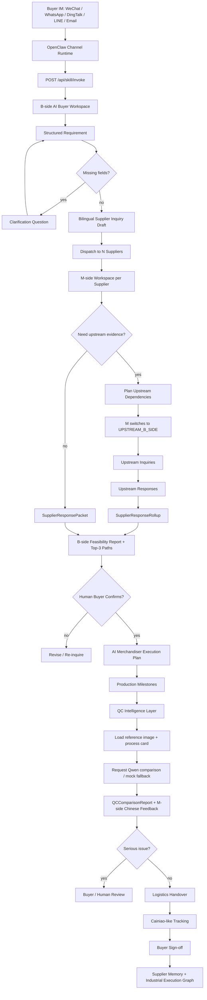

# Giraffe Agent

> Digital procurement and order-execution worker for industrial trade.
> AI Buyer + AI Merchandiser + QC Intelligence + Industrial Execution Graph.
> OpenClaw-compatible skill layer.

[](https://www.python.org/)
[](https://fastapi.tiangolo.com/)
[](https://docs.pydantic.dev/)
[](https://docs.astral.sh/uv/)
[](LICENSE)

---

## What Is Giraffe Agent?

Giraffe Agent is an open-core, project-aware, role-switching agent framework for industrial procurement and order execution.

It is designed for SME buyers, manufacturers, merchandisers, factories, subcontractors, logistics partners, and supplier networks that still coordinate real trade through IM, email, spreadsheets, calls, screenshots, drawings, and fragmented supplier replies.

Giraffe Agent turns that messy execution layer into structured, auditable, human-confirmable workflow state.

It is not a CRM, ERP, marketplace, supplier directory, or chatbot.

It is a **digital procurement and order-execution worker** — an **OpenClaw-compatible skill layer** — that sits inside existing communication channels and helps human legal parties move from inquiry to confirmed order to production execution.

Giraffe Agent has three primary digital worker roles:

| Worker role | Phase | Main responsibility |
|---|---:|---|
| **AI Buyer** | Pre-confirmation | Structure buyer requirements, clarify missing fields, draft supplier inquiries, collect replies, simulate feasible delivery paths |
| **AI Merchandiser** | Post-confirmation | Track order acknowledgement, production milestones, QC/media confirmation, exceptions, logistics handover, buyer sign-off, supplier memory |
| **QC Intelligence** | Post-confirmation | Compare supplier production/QC evidence against reference images and process cards; generate M-side corrective feedback; escalate serious issues to buyer review |

Together, they produce an **Industrial Execution Graph**: an append-only execution record of what actually happened across the order lifecycle.

---

## Current Validation Status

Latest validated commit: `e56770e1ae67d89f314f895edfbf98b9146e0fd4`

CI workflow: **CI / AIVAN ClawHub Plugin** (and sibling jobs — see `.github/workflows/ci.yml`)

Local validation report: [`MAIN_BRANCH_VALIDATION_REPORT.md`](MAIN_BRANCH_VALIDATION_REPORT.md)

Summary of last local validation run:

- Unit tests: 734 passed (result from that specific run; re-run to get current count)
- B-side independent flow: PASS
- M-side independent flow: PASS
- B/M E2E (DB-off): PASS
- B/M E2E (DB-on, SQLite): PASS
- SQLite `PRAGMA integrity_check`: ok
- SQLite `PRAGMA foreign_key_check`: no violations
- AI Merchandiser post-confirmation: PASS
- Logistics ingestion: PASS
- QC Intelligence interface: PASS
- QC mock fallback: PASS
- OpenClaw IM simulated events: PASS
- Role switching (79 checks): PASS
- Lead time model demo: PASS

External-service status:

- **Real Qwen call: SKIPPED** unless `DASHSCOPE_API_KEY` / `QWEN_API_KEY` is configured.
- **Real OpenClaw IM bridge: SKIPPED** unless live OpenClaw channel credentials are configured.
- Local MVP validates interface contracts and mock paths, not production IM operation.

Verdict: **PASS WITH GAPS** — all internal interfaces and mock paths pass; external production calls require credentials.

See [`MAIN_BRANCH_VALIDATION_REPORT.md`](MAIN_BRANCH_VALIDATION_REPORT.md) for exact commands and output.

---

## The New Category

Classical procurement tools assume the buyer already has clean data, known suppliers, formal RFQs, fixed counterparties, and a stable system interface.

Real industrial procurement is different:

- requirements arrive as incomplete IM messages;
- suppliers reply in different formats;
- the same manufacturer can be a supplier to one party and a buyer to another;
- upstream material, trim, subcontracting, packaging, and logistics dependencies are often hidden;
- delivery promises are not enough — execution evidence matters;
- humans still carry legal responsibility for commercial decisions.

Giraffe Agent creates a new execution layer:

> **A digital worker that converts IM/email-based industrial trade into structured, role-aware, evidence-backed order execution.**

The core unit is not a dashboard.
The core unit is an **AI execution worker** operating on a project graph.

---

## Legal and Operating Boundary

Giraffe Agent does not replace the legal parties to a transaction.

It does not become the buyer, seller, manufacturer, freight forwarder, payment obligor, insurer, bank, or contracting party.

Human users and their legal entities remain responsible for:

- approving supplier inquiries;
- confirming quotations;
- selecting delivery paths;
- accepting production schedules;
- approving order commitments;
- releasing payments;
- signing contracts;
- accepting risk.

Giraffe Agent assists by producing:

- structured requirements;
- clarification questions;
- bilingual inquiry drafts;
- supplier response packets;
- delivery feasibility reports;
- evidence-backed Top-3 options;
- production and QC milestone records;
- QC comparison reports and M-side corrective feedback;
- logistics updates;
- exception reports;
- supplier memory updates;
- append-only execution events.

High-stake actions must remain human-confirmed.

---

## Core Product Thesis

Giraffe Agent is built around five product principles.

### 1. Conversation is the real interface

Industrial trade does not start in a clean SaaS form.

It starts in WeChat, WhatsApp, DingTalk, LINE, email, phone notes, drawings, screenshots, PDFs, and informal buyer messages.

Giraffe Agent is designed to work with IM/email-first workflows through an OpenClaw-compatible skill layer and channel adapters.

### 2. Roles are contextual, not fixed

The same company can be:

- a supplier to the original buyer;
- a buyer to its own upstream supplier;
- a coordinator for subcontracting, packaging, or logistics;
- a merchandiser after the order is confirmed.

Giraffe Agent therefore uses a Neutral Actor Model instead of hardcoding B-side and M-side as fixed identities.

### 3. Pre-confirmation and post-confirmation are one execution chain

Most tools stop at sourcing or quotation.

Real orders continue through acceptance, production, QC, media confirmation, logistics handover, tracking, exceptions, buyer sign-off, and supplier memory.

Giraffe Agent connects AI Buyer, AI Merchandiser, and QC Intelligence into one project-aware execution lifecycle.

### 4. Evidence matters more than promises

Supplier-stated lead time is preserved as evidence but not trusted blindly.

Delivery feasibility is calculated from full path dependencies:

- material;
- trim;
- packaging material;
- subcontracting;
- production;
- QC;
- packaging;
- logistics.

Missing fields become risk flags, not fake certainty.

### 5. The execution record must be append-only

Industrial execution needs auditability.

Giraffe Agent records state transitions in an append-only Industrial Execution Graph.

Events are appended, not rewritten.

---

## Core Concept: Neutral Actor Model

> Do not treat B-side and M-side as permanent identities.

An actor's role is contextual. It depends on the project, procurement edge, and counterparty.

The same company may be:

| Role | Meaning |
|---|---|
| `MAIN_M_SIDE` | Main supplier to the original buyer |
| `UPSTREAM_B_SIDE` | Same manufacturer acting as buyer to its own upstream suppliers |

Example:

```text
Buyer B  ->  Manufacturer M
M is MAIN_M_SIDE to B.

Manufacturer M  ->  Fabric Supplier F1
M is UPSTREAM_B_SIDE to F1.
```

Every workflow is project-aware and edge-aware.

This enables recursive supply-chain execution instead of a flat buyer-supplier form.

---

## Example: 10,000-Shirt Sourcing Project

A buyer sends an IM message:

```text
Need 10,000 men's cotton shirts.
Target ship date: end of next month.
Need quote, lead time, fabric options, packaging, and shipping.
```

Giraffe Agent does not simply answer.

It starts a structured execution workflow.

### AI Buyer

1. Parses buyer intent.
2. Extracts quantity, product, deadline, missing specs.
3. Asks clarification questions if required.
4. Drafts bilingual supplier inquiries.
5. Sends inquiries to multiple M-side suppliers.
6. Normalizes supplier replies.
7. Builds delivery paths.
8. Produces Top-3 feasible options for human approval.

### Role-Switching Agent

If a manufacturer needs upstream fabric, trim, packaging, subcontracting, or logistics confirmation:

1. The manufacturer switches into `UPSTREAM_B_SIDE`.
2. The agent drafts upstream inquiries.
3. Upstream supplier replies are parsed.
4. Evidence is rolled up into a supplier-facing response packet.
5. The final buyer-facing quotation is backed by upstream evidence.

### AI Merchandiser

After buyer confirmation:

1. Creates order execution state.
2. Tracks supplier acknowledgement.
3. Tracks production milestones.
4. Collects QC/media confirmation.
5. Reports exceptions.
6. Ingests logistics updates.
7. Records buyer sign-off.
8. Updates Supplier Memory.

### QC Intelligence

When production/QC evidence is submitted:

1. Loads reference image, process card / 工艺卡, and order requirements.
2. Requests comparison via Qwen / Tongyi Qianwen (mock fallback if no key).
3. Generates QCComparisonReport with severity classification.
4. Delivers Chinese-first M-side corrective feedback.
5. Escalates to buyer review for serious issues only.
6. Appends event to Industrial Execution Graph.

---

## Architecture

```text
+-----------------------------------------------------------------------------+
| Channel Runtime Layer                                                       |
|   OpenClaw / compatible IM-email runtime                                    |
|   WeChat / WhatsApp / DingTalk / LINE / Email / Web / other IM channels     |
|   Giraffe does not store IM platform credentials directly                   |
+-----------------------------------------------------------------------------+
| OpenClaw Skill Layer                                                        |
|   /api/skill/invoke                                                         |
|   normalized event adapter  role-aware router  B/M action dispatcher        |
+-----------------------------------------------------------------------------+
| Workflow Layer                                                              |
|   AI Buyer: requirement -> inquiry -> feasibility                           |
|   Supplier Response Agent                                                   |
|   Role-Switching Procurement Agent                                          |
|   Professional Free CAD<->CNC matching                                      |
|   AI Merchandiser: milestones  media  exceptions  logistics                 |
|   QC Intelligence: image/video/process-card comparison (Qwen-requested)     |
|   Cainiao-like logistics ingestion                                          |
+-----------------------------------------------------------------------------+
| LLM / Intelligence Layer                                                    |
|   Default requested provider: Qwen / Tongyi Qianwen                         |
|   Mock fallback for local/CI when no key is configured                      |
|   Provider registry: Qwen  Mock  OpenAI  Anthropic  DeepSeek                |
+-----------------------------------------------------------------------------+
| Bridge Layer                                                                |
|   Inquiry Dispatcher  Response Bridge  Order Bridge                         |
+-----------------------------------------------------------------------------+
| Persistence Layer                                                           |
|   JSON runtime stores  SQLite local  PostgreSQL-portable ORM                |
|   Actors  Projects  Edges  RoleContexts  Requirements                       |
|   Inquiries  Responses  Rollups  Milestones  QC Reports  Shipments          |
+-----------------------------------------------------------------------------+
| Industrial Execution Graph v0.1                                             |
|   Append-only ExecutionEvent log + procurement_edges                        |
+-----------------------------------------------------------------------------+
```

---

## End-to-End Flow



---

## Main Modules

| # | Module | Phase | Purpose |
|---:|---|---|---|
| 1 | OpenClaw Skill Layer | Channel / Runtime | Normalized IM/email event intake via `/api/skill/invoke`; compatible with WeChat, WhatsApp, DingTalk, LINE, email, and other channels |
| 2 | AI Buyer | Pre-confirmation | Structure requirements, draft bilingual inquiries, run delivery feasibility simulation |
| 3 | Supplier Response Agent | Pre-confirmation | M-side intake, normalization, `SupplierResponsePacket` |
| 4 | Role-Switching Procurement Agent | Pre-confirmation | Recursive `UPSTREAM_B_SIDE` logic, upstream inquiry builder, option engine, approval gate |
| 5 | Professional Free CAD->CNC Matching | Pre-confirmation | CAD Requirement Packet, Capability Fit Report, machine profile matching |
| 6 | AI Merchandiser | Post-confirmation | Production milestones, QC/media confirmation, exception reporting, logistics handover, buyer sign-off |
| 7 | QC Intelligence Layer | Post-confirmation | Image/video-frame comparison against reference images and process cards; M-side corrective feedback; buyer escalation; Qwen is the default requested provider with mock fallback |
| 8 | Send/Receive Role Switching | Post-confirmation | M-side send/receive mode transitions |
| 9 | Cainiao-like Logistics Ingestion | Post-confirmation | Carrier API normalization and shipment tracking ingestion |
| 10 | LLM Provider Layer | Cross-cutting | Qwen / Tongyi Qianwen default provider, deterministic mock fallback, optional OpenAI / Anthropic / DeepSeek providers |
| 11 | Database Layer | Cross-cutting | SQLAlchemy models, Alembic migrations, SQLite->PostgreSQL portability |
| 12 | Dynamic Self-Learning Schema | Cross-cutting | AI observes and proposes new fields without altering physical tables at runtime |
| 13 | Industrial Execution Graph | Cross-cutting | Append-only event log for every state transition across all actors |

---

## Current MVP Scope

The current repository is an MVP implementation.

It is designed to prove the execution model, not to claim production completeness.

Implemented MVP capabilities include:

- FastAPI application entry point;
- OpenClaw-compatible skill invocation route;
- B-side enquiry workspace;
- requirement structuring;
- bilingual supplier inquiry drafting;
- supplier workspace creation;
- B/M inquiry dispatch;
- M-side supplier response handling;
- response bridge back to B-side;
- role-switching procurement logic;
- CAD->CNC Professional Free matching;
- order execution creation;
- AI Merchandiser workflow;
- production, QC, and logistics updates;
- QC Intelligence Layer with Qwen-requested comparison and mock fallback;
- Cainiao-like logistics ingestion;
- SQLAlchemy models;
- Alembic migration support;
- SQLite local mode;
- PostgreSQL-portable model design;
- append-only execution events;
- reproducible E2E scripts.

Production hardening still requires:

- real Qwen API key for live QC comparison calls;
- real OpenClaw channel credentials for live IM/email integration;
- authentication and authorization;
- production PostgreSQL deployment;
- observability;
- security hardening;
- UI;
- deployment packaging;
- enterprise permission model;
- commercial-grade audit controls.

---

## Quick Start

### Prerequisites

- Python 3.11+
- [`uv`](https://docs.astral.sh/uv/) package manager

### Setup

```bash
git clone https://github.com/GiraffeTechnology/giraffe-agent.git
cd giraffe-agent

uv sync

uv run python scripts/init_db.py
uv run python scripts/seed_mvp_data.py

uv run uvicorn api.main:app --reload
```

The API will be available at `http://localhost:8000`.
Interactive docs: `http://localhost:8000/docs`

---

## LLM Configuration

Giraffe Agent uses **Qwen / Tongyi Qianwen** as the default requested LLM provider.

Local and CI behavior (safe defaults):

```bash
LLM_PROVIDER=qwen
QC_AUTO_COMPARE_PROVIDER=qwen
LLM_ENABLE_REAL_CALLS=false
QC_ALLOW_EXTERNAL_LLM=false
```

When no Qwen API key is available, the provider registry falls back to the deterministic mock provider. Reports still record:

```json
{
  "requested_provider": "qwen",
  "provider_name": "mock",
  "fallback_used": true
}
```

To enable real Qwen calls:

```bash
export DASHSCOPE_API_KEY="..."
# or
export QWEN_API_KEY="..."
export LLM_ENABLE_REAL_CALLS=true
export QC_ALLOW_EXTERNAL_LLM=true
export LLM_PROVIDER=qwen
export QC_AUTO_COMPARE_PROVIDER=qwen
```

Data safety defaults:

```bash
QC_ALLOW_EXTERNAL_LLM=false
QC_ALLOW_CAD_TO_LLM=false
QC_ALLOW_BOM_TO_LLM=false
QC_REDACT_PROCESS_CARD=true
```

By default, confidential CAD/BOM/contract/pricing information is not sent to external LLMs.

---

## QC Intelligence Layer

The QC Intelligence Layer compares supplier-submitted production/QC evidence against approved references and process cards. It uses Qwen / Tongyi Qianwen as the default requested LLM provider and falls back to the deterministic mock provider when no API key is configured.

**Inputs:**

- Supplier production image
- Supplier QC image
- Sample / reference / golden image
- Video frames
- Process card / 工艺卡
- Order requirements

**Outputs:**

- `QCComparisonReport`
- Chinese-first M-side corrective feedback
- English summary
- Severity classification
- Buyer escalation decision
- Human review flag
- Industrial Execution Graph event

**Typical flow:**

```text
M-side uploads QC image/video
-> Giraffe loads reference image + process card
-> Qwen provider is requested
-> Mock fallback is used if no key is configured
-> QCComparisonReport is generated
-> M-side receives corrective feedback in Chinese
-> buyer review is triggered only for serious issues
```

Run QC validation:

```bash
uv run python scripts/run_qc_llm_comparison_mvp.py
uv run python scripts/run_qwen_qc_smoke_test.py
```

Expected local behavior without Qwen key:

```text
QC LLM COMPARISON MVP COMPLETE: 26 passed, 0 failed
QWEN REAL CALL SKIPPED: missing API key
```

---

## OpenClaw / IM Integration

Giraffe Agent is designed as an **OpenClaw-compatible skill layer**.

The channel architecture is:

```text
WeChat / WhatsApp / DingTalk / LINE / Email / Web / other IM channels
-> OpenClaw or compatible channel runtime
-> normalized event
-> POST /api/skill/invoke
-> OpenClaw event adapter
-> Giraffe B-side / M-side / QC / logistics workflow
```

Giraffe Agent **does not directly store IM platform credentials**. IM account control, message sending, and message receiving are expected to be handled by OpenClaw or a compatible runtime. This applies to all supported channels (WeChat, WhatsApp, DingTalk, LINE, email, and others).

The OpenClaw event adapter supports simulated IM events through normalized payload fields such as:

```json
{
  "source": "openclaw",
  "channel": "wechat",
  "channel_account_id": "wechat-account-test",
  "conversation_id": "wechat-conv-buyer-test",
  "sender_id": "wechat-user-buyer-001",
  "sender_display_name": "Buyer WeChat Test",
  "message_text": "I need 100 cotton polo shirts within 45 days.",
  "message_type": "text",
  "attachments": [],
  "mode": "b_side"
}
```

Run OpenClaw validation:

```bash
uv run pytest tests/test_openclaw_integration.py
```

Real IM bridge validation (any channel) requires live OpenClaw channel credentials and is not enabled by default.

---

## E2E Verification

Run the verification suite after setup.

### B/M-side DB Integration Baseline

```bash
GIRAFFE_DB_MODE=off uv run python run_bm_e2e_with_db.py

GIRAFFE_DB_MODE=on GIRAFFE_DB_URL=sqlite:///./test.db uv run python build_schema.py
GIRAFFE_DB_MODE=on GIRAFFE_DB_URL=sqlite:///./test.db uv run python run_bm_e2e_with_db.py

uv run python verify_integration.py --db sqlite:///./test.db --runs 5
```

Expected successful baseline:

```text
run 1/5: PASS  run 2/5: PASS  run 3/5: PASS  run 4/5: PASS  run 5/5: PASS
PRAGMA integrity_check: ok
PRAGMA foreign_key_check: ok
Result: 5/5 passed
```

### Lead Time Path Model

The B-side feasibility engine uses a path-based lead time calculation.

Key rules:

- Material, trim, packaging-material, and subcontract dependencies run in parallel, so use `max()`.
- Production, QC, packaging, and logistics run sequentially, so use `sum()`.
- Supplier-stated lead time is preserved as evidence but not trusted blindly.
- Missing fields create `risk_flags`; never use fake sentinel values such as `999`.

Run:

```bash
uv run python scripts/run_lead_time_model_demo.py
```

Expected output: `LEAD TIME MODEL DEMO: PASS`

### Main Branch Validation

Latest validated commit: `e56770e1ae67d89f314f895edfbf98b9146e0fd4`

See [`MAIN_BRANCH_VALIDATION_REPORT.md`](MAIN_BRANCH_VALIDATION_REPORT.md) for exact commands, output, and verdict.

Summary:

- Unit tests: 734 passed (from last documented run — re-run for current count)
- B-side independent flow: PASS
- M-side independent flow: PASS
- B/M E2E (DB-off and DB-on): PASS
- AI Merchandiser: PASS
- Logistics: PASS
- QC Intelligence interface: PASS
- OpenClaw IM simulated events: PASS
- Role switching (79 checks): PASS
- Lead time model: PASS

Verdict: `PASS WITH GAPS`

Gaps (explicit — not failures):

- Real Qwen call: **SKIPPED** — requires `DASHSCOPE_API_KEY` or `QWEN_API_KEY`
- Real OpenClaw IM bridge: **SKIPPED** — requires live OpenClaw channel credentials
- Local MVP validates interface contracts and mock paths, not production IM operation

### MVP E2E Scripts

| Script | What it verifies |
|--------|-----------------|
| `scripts/run_db_smoke_test.py` | Database models, migrations, seed data |
| `scripts/run_bm_e2e_mvp.py` | Full B+M minimum loop (18 steps) |
| `scripts/run_role_switching_mvp.py` | Role-Switching Agent (79 checks) |
| `scripts/run_mside_professional_free_cad_cnc_mvp.py` | CAD->CNC matching (78 checks) |
| `scripts/run_mside_send_receive_role_switch_test.py` | M-side send/receive role switching |
| `scripts/run_merchandiser_e2e_mvp.py` | AI Merchandiser full flow |
| `scripts/run_logistics_cainiao_like_api_mvp.py` | Logistics ingestion and normalization |
| `scripts/run_integrated_post_confirmation_mvp.py` | Integrated post-confirmation (56 checks) |
| `scripts/run_lead_time_model_demo.py` | Lead Time Path Model deterministic verification |
| `scripts/run_qc_llm_comparison_mvp.py` | QC comparison with Qwen-requested provider and mock fallback, reference image, process card, image/video-frame checks |
| `scripts/run_qwen_qc_smoke_test.py` | Real Qwen smoke test if key exists; safe skip if no key |

```bash
uv run python scripts/run_db_smoke_test.py
uv run python scripts/run_bm_e2e_mvp.py
uv run python scripts/run_role_switching_mvp.py
uv run python scripts/run_mside_professional_free_cad_cnc_mvp.py
uv run python scripts/run_merchandiser_e2e_mvp.py
uv run python scripts/run_logistics_cainiao_like_api_mvp.py
uv run python scripts/run_integrated_post_confirmation_mvp.py
uv run python scripts/run_lead_time_model_demo.py
uv run python scripts/run_qc_llm_comparison_mvp.py
uv run python scripts/run_qwen_qc_smoke_test.py
```

### Unit Tests

```bash
uv run pytest
```

---

## API Overview

The FastAPI application entry point is `api.main:app`.
The root `main.py` is only a lightweight helper for local developer guidance.

Primary route groups:

| Route | Purpose |
|---|---|
| `GET /health` | Health check |
| `POST /api/skill/invoke` | OpenClaw skill invocation for normalized IM/email events (WeChat, WhatsApp, DingTalk, LINE, email, and others) |
| `POST /api/b-side/workspaces` | Create a B-side Enquiry Workspace |
| `POST /api/b-side/workspaces/{id}/structure-requirement` | Structure raw buyer requirement |
| `POST /api/b-side/workspaces/{id}/draft-inquiry` | Draft bilingual supplier inquiry |
| `POST /api/b-side/workspaces/{id}/run-feasibility` | Run delivery feasibility simulation |
| `POST /api/m-side/suppliers` | Create supplier profile |
| `POST /api/bm/dispatch-inquiry` | Dispatch inquiry to supplier workspaces |
| `POST /api/bm/push-response-to-b-side` | Push M-side response back to B-side |
| `POST /api/bm/create-order-execution` | Create order execution from selected delivery path |
| `POST /api/m-side/orders/{id}/acknowledge` | Supplier order acknowledgement |
| `POST /api/m-side/orders/{id}/production-update` | Submit production update |
| `POST /api/m-side/orders/{id}/qc-update` | Submit QC confirmation |
| `POST /api/m-side/orders/{id}/logistics-update` | Submit logistics handover |
| `GET /api/qc/health` | QC module health check |
| `POST /api/qc/{project_id}/reference-images` | Add QC reference / golden sample image |
| `GET /api/qc/{project_id}/reference-images` | List QC reference images |
| `POST /api/qc/{project_id}/process-card` | Create process card / 工艺卡 |
| `GET /api/qc/{project_id}/process-card` | Get latest process card |
| `POST /api/qc/{project_id}/compare` | Run Qwen-requested QC comparison |
| `GET /api/qc/{project_id}/reports` | List QC reports |
| `GET /api/qc/reports/{report_id}` | Get QC report |
| `POST /api/qc/{project_id}/buyer-decision` | Record buyer QC decision |

Full interactive documentation is available at `/docs` when the server is running.

---

## Repository Structure

```text
giraffe-agent/
+-- api/                        # FastAPI application
|   +-- main.py
+-- src/
|   +-- b_side/                 # AI Buyer: requirement structurer, inquiry drafter, feasibility engine
|   +-- m_side/                 # Supplier Response Agent, Role-Switching Agent, AI Merchandiser
|   |   +-- professional_free/  # CAD->CNC matching (no Enterprise CAP)
|   |   +-- rollup/             # SupplierResponseRollup builder
|   |   +-- upstream/           # Upstream inquiry builder, option engine, approval gate
|   +-- bm_bridge/              # Inquiry dispatcher, response bridge, order bridge
|   +-- channels/               # Optional local channel helpers; production IM through OpenClaw
|   +-- llm/                    # Qwen-first provider layer, mock fallback, optional providers
|   +-- openclaw_skill/         # OpenClaw skill manifest, event adapter, skill router
|   +-- actors/                 # Neutral actor model, role resolver
|   +-- projects/               # Project graph
|   +-- core_schema/            # Pydantic types for B-side and M-side
|   +-- merchandiser/           # Post-confirmation execution engine
|   |   +-- qc/                 # QC reference images, process cards, comparison, reports, policy
|   +-- logistics/              # Cainiao-like logistics ingestion
|   +-- db/                     # SQLAlchemy models, mixins, Alembic config
+-- scripts/                    # Setup, seed, and E2E verification scripts
+-- alembic/                    # Database migrations
+-- docs/                       # Product requirement documents (do not modify)
+-- data/                       # Runtime workspace files and event log
+-- openclaw/                   # OpenClaw skill packaging
+-- PATENT_NOTICE.md
+-- LICENSE_NOTICE.md
+-- LICENSE
+-- pyproject.toml
```

---

## Design Constraints

These invariants are non-negotiable.

### Neutral Actor Model

Never hardcode B-side or M-side as fixed actor identities.

Roles are contextual per `Project` and `ProcurementEdge`.

### Human Confirmation

Giraffe Agent must not create commercial commitments without human approval.

High-stake actions require explicit confirmation.

### No Faked Data

If parsing is uncertain, surface a clarification question or risk flag.

Never invent supplier data, prices, dates, capacity, material availability, logistics status, CAD properties, or buyer approvals.

### Append-Only Execution Graph

`execution_events` must never be updated or deleted.

State changes are appended.

### Dynamic Schema Rule

AI may observe and propose new fields.

It must not directly alter physical database table definitions at runtime.

### No Enterprise CAP in MVP

The Professional Free tier explicitly has no file encryption, dynamic watermarking, secure viewer, or no-download rooms.

Do not add Enterprise CAP features to the MVP tier.

### OpenClaw Boundary

Giraffe Agent should receive normalized IM/email events from OpenClaw or compatible runtimes. It should not directly store IM platform credentials for any channel (WeChat, WhatsApp, DingTalk, LINE, or others).

### AI Is Not a Legal Actor

AI-generated recommendations, QC feedback, delivery paths, and supplier comparisons are decision-support artifacts. Human/legal entities remain responsible for acceptance and contractual decisions.

### External LLM Safety

External LLM calls are disabled by default. CAD, BOM, pricing, buyer identity, supplier contacts, and contract terms must not be sent externally unless explicitly enabled and redacted.

### Mock Is Not Real Provider

When Qwen credentials are absent, mock fallback is allowed for tests, but README and reports must say the real Qwen call was skipped.

---

## Tech Stack

| Component | Choice |
|---|---|
| Language | Python 3.11+ |
| API framework | FastAPI + Uvicorn |
| Data validation | Pydantic v2 |
| ORM | SQLAlchemy 2.x |
| Migrations | Alembic |
| Local database | SQLite |
| Production-portable database | PostgreSQL |
| Package manager | `uv` |
| Default LLM provider | Qwen / Tongyi Qianwen |
| Local/CI LLM fallback | Deterministic mock provider |
| Channel runtime | OpenClaw-compatible IM/email runtime |
| Primary channel integration | OpenClaw-compatible normalized events; WeChat/WhatsApp/DingTalk/LINE/email and other IM channels handled by channel runtime |
| QC intelligence | Image/video-frame/process-card comparison via Qwen-requested provider |

---

## How to Contribute

Giraffe Agent is an open MVP.

Good contribution paths include:

### Backend / Core

- Replace rule-based stubs with real LLM provider integrations.
- Extend requirement structuring with confidence scoring.
- Improve feasibility ranking and path comparison.
- Add richer Industrial Execution Graph query and replay APIs.
- Implement dynamic schema observation and proposal logic.
- Add richer QC report visualization and buyer review UI.
- Improve Qwen real-call examples for image/video QC once production credentials are available.

### Channels

- Build production OpenClaw channel connectors and deployment examples for WeChat, WhatsApp, DingTalk, LINE, email, and other IM runtimes.
- Add real credential-based OpenClaw bridge smoke tests outside the default CI path.
- Add channel-specific human confirmation flows.

### Matching and Intelligence

- Improve CAD->CNC capability scoring.
- Add supplier memory retrieval into feasibility simulation.
- Add evidence scoring for supplier replies.
- Improve risk flag generation for missing or inconsistent fields.

### Production / Ops

- Migrate local workflows to PostgreSQL.
- Add authentication middleware.
- Add tenant/project permission model.
- Add observability and audit logs.
- Build buyer-facing and supplier-facing UI.

### Testing

- Add unit tests for individual modules.
- Add regression tests for role-switching edge cases.
- Add golden-path tests for multi-supplier inquiry flows.
- Add post-confirmation exception scenario tests.

Before submitting a PR, run the E2E suite and make sure the relevant scripts still pass.

---

## ClawHub / OpenClaw Plugin Publication

AIVAN is published as an installable ClawHub code plugin via the `@giraffetechnology/openclaw-aivan` plugin bridge.

### Prerequisites

```bash
npm i -g clawhub
clawhub login
clawhub whoami
```

### Validate Plugin Before Publishing

```bash
# Validate metadata and structure
uv run python scripts/validate_clawhub_aivan_plugin.py

# Run smoke test (requires AIVAN running locally)
uv run uvicorn api.main:app --reload &
uv run python scripts/run_aivan_openclaw_plugin_smoke_test.py
```

### Publish Code Plugin (Dry Run First)

```bash
clawhub package publish integrations/openclaw-aivan-plugin --family code-plugin --dry-run
```

### Publish Code Plugin

```bash
clawhub package publish integrations/openclaw-aivan-plugin --family code-plugin
```

### Publish Skill Listing (Optional — for discoverability)

```bash
clawhub skill publish skills/aivan-trade-salesperson \
  --slug aivan-trade-salesperson \
  --name "AIVAN Trade Salesperson" \
  --version 0.1.0 \
  --changelog "Initial AIVAN ClawHub skill listing"
```

### Plugin Security Contract

- The plugin never stores IM credentials, channel tokens, or platform secrets
- All outbound messages require human approval via AIVAN's approval gate
- AIVAN data stays local (SQLite / JSON files on your machine)
- Mock mode works without any external API keys
- See [`integrations/openclaw-aivan-plugin/SECURITY.md`](integrations/openclaw-aivan-plugin/SECURITY.md) and [`SECURITY.md`](SECURITY.md)

---

## Patent Notice and License

This repository is released under the Apache-2.0 software license.

Certain workflows, system logic, role-based participant coordination mechanisms, and multi-party C2M / order execution workflows in this project may be covered by patents owned by Giraffe Technology Holding Limited.

| Jurisdiction | Patent |
|---|---|
| China | ZL 2023 1 1645939.9 / CN 117670482 B |
| Japan | P7644545 / 特許第7644545号 |

Giraffe Technology Holding Limited grants a Global Free Patent License to:

- individuals;
- developers;
- researchers;
- students;
- SMEs for their own procurement, production coordination, and sourcing;
- educational institutions for teaching and non-commercial use;
- research institutions for non-commercial research.

Separate written permission is required for:

- enterprise deployment;
- platform operation;
- high-volume commercial production use;
- third-party system integration;
- white-label, OEM, or resale;
- Enterprise CAP;
- use of Giraffe commercial assets, trademarks, supplier/buyer network data, or order archives.

Access to this source code does not automatically grant patent rights beyond the free license scope.

See:

- [`PATENT_NOTICE.md`](PATENT_NOTICE.md)
- [`LICENSE_NOTICE.md`](LICENSE_NOTICE.md)
- [`LICENSE`](LICENSE)

Authorization contact:

```text
mich@giraffe.technology
```

---

## Project Status

Giraffe Agent is currently an open MVP.

The repository demonstrates the core execution model:

```text
IM/email input (WeChat / WhatsApp / DingTalk / LINE / Email / Web)
-> OpenClaw channel runtime
-> POST /api/skill/invoke
-> role-aware structured requirement
-> supplier inquiry
-> recursive upstream sourcing
-> delivery feasibility
-> human confirmation
-> order execution
-> AI Merchandiser
-> QC Intelligence Layer (Qwen-requested, mock fallback)
-> logistics / exception tracking
-> buyer sign-off
-> Supplier Memory
-> Industrial Execution Graph
```

It is ready for developer contribution, technical review, scenario extension, and deeper channel integration.

It is not yet a production-ready enterprise deployment.
