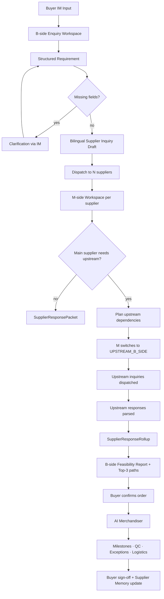

# Giraffe Agent

> **Project-aware, role-switching procurement execution agent for SMEs.**
> AI Buyer + AI Merchandiser + Industrial Execution Graph.

[](https://www.python.org/)
[](https://fastapi.tiangolo.com/)
[](https://docs.pydantic.dev/)
[](https://docs.astral.sh/uv/)

---

## What Is Giraffe Agent?

Giraffe Agent is the **missing execution layer** between IM-based industrial procurement and structured order delivery. It is *not* a CRM, ERP, marketplace, or chatbot.

It solves three problems that classical procurement software does not:

1. **Pre-confirmation decision support** — the **AI Buyer** structures buyer requirements from IM messages, drafts bilingual supplier inquiries, ingests supplier replies, and simulates Top-3 delivery paths.
2. **Recursive role switching** — a manufacturer is M-side to its buyer *and* B-side to its own fabric/material/subcontract/logistics suppliers in the *same* project. Giraffe Agent identifies these roles per procurement edge and rolls upstream evidence into a credible buyer-facing response.
3. **Post-confirmation execution** — the **AI Merchandiser** handles supplier acceptance, production milestones, media confirmation, exception reporting, logistics handover, shipment tracking (Cainiao-like aggregator), buyer sign-off, and Supplier Memory updates.

```
AI Buyer        = pre-confirmation decision support
AI Merchandiser = post-confirmation execution support
```

Together they form the **Industrial Execution Graph v0.1** — a project-aware, event-sourced graph that records what *actually happened* in the supply chain, not what was promised.

---

## Core Concept: Neutral Actor Model

> **Do not treat B-side and M-side as fixed identities.**

An actor's role is contextual — it depends on the project, the procurement edge, and the counterparty. The same company can be:

- `MAIN_M_SIDE` — main supplier to the original buyer
- `UPSTREAM_B_SIDE` — same manufacturer acting as buyer to its own upstream suppliers

**Example — 100-shirt project:**
```
Buyer B  →  Manufacturer M   (M is MAIN_M_SIDE to B)
Manufacturer M  →  Fabric Supplier F1   (M is UPSTREAM_B_SIDE to F1)
```

Every workflow is **project-aware** and **edge-aware**.

---

## Architecture

```
┌─────────────────────────────────────────────────────────────────────┐
│ IM / OpenClaw Layer                                                 │
│   OpenClaw skill manifest · WeChat / WhatsApp / Web adapters        │
├─────────────────────────────────────────────────────────────────────┤
│ Conversation Orchestration Layer                                    │
│   Session resolution · Role-aware IM router · Intent routing        │
├─────────────────────────────────────────────────────────────────────┤
│ Workflow Layer                                                      │
│   B-side: AI Buyer (requirement → inquiry → feasibility)            │
│   M-side: Supplier Response Agent + Role-Switching Agent            │
│   M-side: Professional Free CAD↔CNC matching                        │
│   AI Merchandiser: milestones · media · exceptions · logistics      │
│   Cainiao-like logistics ingestion                                  │
├─────────────────────────────────────────────────────────────────────┤
│ Bridge Layer                                                        │
│   Inquiry Dispatcher (B→M) · Response Bridge (M→B) · Order Bridge  │
├─────────────────────────────────────────────────────────────────────┤
│ Persistence Layer                                                   │
│   SQLite (local) / PostgreSQL (production-portable)                 │
│   Actors · Projects · Edges · RoleContexts · Requirements           │
│   Inquiries · Responses · Rollups · Milestones · Shipments          │
├─────────────────────────────────────────────────────────────────────┤
│ Industrial Execution Graph v0.1                                     │
│   Append-only ExecutionEvent log + procurement_edges                │
└─────────────────────────────────────────────────────────────────────┘
```

**End-to-end flow:**



---

## Modules

| # | Module | Phase |
|---|--------|-------|
| 1 | **AI Buyer** — structures requirements, drafts bilingual supplier inquiries, runs delivery feasibility simulation | Pre-confirmation |
| 2 | **Supplier Response Agent** — M-side intake, normalization, SupplierResponsePacket | Pre-confirmation |
| 3 | **Role-Switching Procurement Agent** — recursive UPSTREAM_B_SIDE logic, upstream inquiry builder, option engine, approval gate | Pre-confirmation |
| 4 | **Professional Free CAD↔CNC Matching** — CAD Requirement Packet, Capability Fit Report, machine profile matching (no encryption, no watermarking) | Pre-confirmation |
| 5 | **AI Merchandiser** — post-confirmation milestones, production/QC/exception updates, logistics handover, buyer sign-off | Post-confirmation |
| 6 | **Send/Receive Role Switching** — M-side send/receive mode transitions | Post-confirmation |
| 7 | **Cainiao-like Logistics Ingestion** — carrier API normalization, shipment tracking ingestion | Post-confirmation |
| 8 | **Database Layer** — SQLAlchemy models, Alembic migrations, SQLite→PostgreSQL portable | Cross-cutting |
| 9 | **Dynamic Self-Learning Schema** — AI observes and proposes new fields without altering physical tables at runtime | Cross-cutting |
| 10 | **Industrial Execution Graph v0.1** — append-only event log for every state transition across all actors | Cross-cutting |

---

## Quick Start

### Prerequisites

- Python 3.11+
- [`uv`](https://docs.astral.sh/uv/getting-started/installation/) package manager

### Setup

```bash
# 1. Clone the repo
git clone https://github.com/GiraffeTechnology/giraffe-agent.git
cd giraffe-agent

# 2. Install dependencies
uv sync

# 3. Initialize the database (SQLite)
uv run python scripts/init_db.py

# 4. Seed MVP reference data
uv run python scripts/seed_mvp_data.py

# 5. Start the API server
uv run uvicorn api.main:app --reload
```

The API will be available at `http://localhost:8000`.  
Interactive docs: `http://localhost:8000/docs`

---

## E2E Verification

Each script verifies a complete workflow end-to-end. Run them after setup to confirm everything is wired correctly.

| Script | What it verifies |
|--------|-----------------|
| `scripts/run_db_smoke_test.py` | Database models, migrations, seed data |
| `scripts/run_bm_e2e_mvp.py` | Full B+M minimum loop (18 steps) |
| `scripts/run_role_switching_mvp.py` | Role-Switching Agent (79 checks) |
| `scripts/run_mside_professional_free_cad_cnc_mvp.py` | CAD↔CNC matching (78 checks) |
| `scripts/run_mside_send_receive_role_switch_test.py` | M-side send/receive role switching |
| `scripts/run_merchandiser_e2e_mvp.py` | AI Merchandiser full flow |
| `scripts/run_logistics_cainiao_like_api_mvp.py` | Logistics ingestion and normalization |
| `scripts/run_integrated_post_confirmation_mvp.py` | Integrated post-confirmation (56 checks) |

```bash
# Run all E2E scripts in sequence
uv run python scripts/run_db_smoke_test.py
uv run python scripts/run_bm_e2e_mvp.py
uv run python scripts/run_role_switching_mvp.py
uv run python scripts/run_mside_professional_free_cad_cnc_mvp.py
uv run python scripts/run_merchandiser_e2e_mvp.py
uv run python scripts/run_logistics_cainiao_like_api_mvp.py
uv run python scripts/run_integrated_post_confirmation_mvp.py
```

### Unit Tests

```bash
uv run pytest
```

---

## API Overview

The FastAPI application entry point is `api.main:app`; the root `main.py` is only a lightweight helper for local developer guidance.

The FastAPI server exposes the following route groups:

| Prefix | Description |
|--------|-------------|
| `GET /health` | Health check |
| `POST /api/skill/invoke` | OpenClaw skill invocation (routes to B-side or M-side handlers) |
| `POST /api/b-side/workspaces` | Create a B-side Enquiry Workspace |
| `POST /api/b-side/workspaces/{id}/structure-requirement` | Structure raw buyer requirement |
| `POST /api/b-side/workspaces/{id}/draft-inquiry` | Draft bilingual supplier inquiry |
| `POST /api/b-side/workspaces/{id}/run-feasibility` | Run delivery feasibility simulation |
| `POST /api/m-side/suppliers` | Create supplier profile |
| `POST /api/bm/dispatch-inquiry` | Dispatch inquiry to supplier workspaces |
| `POST /api/bm/push-response-to-b-side` | Push M-side response back to B-side |
| `POST /api/bm/create-order-execution` | Create order execution from selected delivery path |
| `POST /api/m-side/orders/{id}/acknowledge` | Supplier order acknowledgement |
| `POST /api/m-side/orders/{id}/production-update` | Submit production update |
| `POST /api/m-side/orders/{id}/qc-update` | Submit QC confirmation |
| `POST /api/m-side/orders/{id}/logistics-update` | Submit logistics handover |

Full interactive documentation available at `/docs` when the server is running.

---

## Repository Structure

```
giraffe-agent/
├── api/                        # FastAPI application
│   └── main.py
├── src/
│   ├── b_side/                 # AI Buyer: requirement structurer, inquiry drafter, feasibility engine
│   ├── m_side/                 # Supplier Response Agent, Role-Switching Agent, AI Merchandiser
│   │   ├── professional_free/  # CAD↔CNC matching (no Enterprise CAP)
│   │   ├── rollup/             # SupplierResponseRollup builder
│   │   └── upstream/           # Upstream inquiry builder, option engine, approval gate
│   ├── bm_bridge/              # Inquiry dispatcher, response bridge, order bridge
│   ├── channels/               # WeChat / WhatsApp / Web adapters, IM router
│   ├── openclaw_skill/         # OpenClaw skill manifest and router
│   ├── actors/                 # Neutral actor model, role resolver
│   ├── projects/               # Project graph
│   ├── core_schema/            # Pydantic types for B-side and M-side
│   ├── merchandiser/           # Post-confirmation execution engine
│   ├── logistics/              # Cainiao-like logistics ingestion
│   └── db/                     # SQLAlchemy models, mixins, Alembic config
├── scripts/                    # Setup, seed, and E2E verification scripts
├── alembic/                    # Database migrations
├── docs/                       # Product requirement documents (do not modify)
├── data/                       # Runtime workspace files and event log
├── PATENT_NOTICE.md
├── LICENSE_NOTICE.md
└── pyproject.toml
```

---

## How to Contribute

Giraffe Agent is an open MVP — there is a lot of room to improve and extend it. Here are good starting points:

**Backend / Core**
- Add real LLM calls to replace the rule-based stubs in `requirement_structurer.py` and `inquiry_drafter.py`
- Implement `dynamic_schema` observation and proposal logic in `src/db/models/dynamic_schema.py`
- Extend the Industrial Execution Graph with richer event types and replay/query APIs

**Channels**
- Wire up real WeChat or WhatsApp webhook adapters in `src/channels/`
- Build an OpenClaw-compatible skill manifest response formatter

**Matching & Intelligence**
- Improve CAD↔CNC capability matching scoring in `src/m_side/professional_free/cad_cnc_matcher.py`
- Add supplier memory retrieval into the feasibility simulation

**Production / Ops**
- Migrate from SQLite to PostgreSQL (the models are already JSONB-portable)
- Add authentication middleware to the FastAPI app
- Build a simple buyer-facing or supplier-facing web UI

**Testing**
- Add unit tests for individual modules in `tests/`
- Add regression coverage for the role-switching edge cases

Before submitting a pull request, run the full E2E suite and make sure all scripts still pass.

---

## Design Constraints (Read Before Modifying)

These are non-negotiable product invariants — don't work around them:

- **Neutral Actor Model:** Never hardcode B-side/M-side as a fixed actor identity. Roles are contextual per `Project` + `ProcurementEdge`.
- **No Enterprise CAP in MVP:** The Professional Free tier explicitly has no file encryption, dynamic watermarking, secure viewer, or no-download rooms. Do not add these.
- **Dynamic Schema Rule:** AI may observe and propose new fields; it must not directly alter physical database table definitions at runtime.
- **No Faked Data:** If parsing is uncertain, surface a clarification question. Never invent data.
- **Append-Only Graph:** `execution_events` must never be updated or deleted — only appended to.

---

## Tech Stack

| Component | Choice |
|-----------|--------|
| Language | Python 3.11+ |
| API framework | FastAPI + Uvicorn |
| Data validation | Pydantic v2 |
| ORM | SQLAlchemy 2.x |
| Migrations | Alembic |
| Database (local) | SQLite |
| Database (production) | PostgreSQL |
| Package manager | `uv` |
| Primary channels | OpenClaw, WeChat, WhatsApp, Web fallback |

---

## Patent Notice & License

Certain workflows, system logic, role-based participant coordination mechanisms, and multi-party C2M / order execution workflows in this project may be covered by patents owned by **Giraffe Technology Holding Limited**:

| Jurisdiction | Patent |
|---|---|
| China | ZL 2023 1 1645939.9 / CN 117670482 B |
| Japan | P7644545 / 特許第7644545号 |

**Global Free Patent License** — Giraffe Technology Holding Limited grants a free patent license to:
- Individuals (developers, researchers, students)
- SMEs (for own procurement, production coordination, and sourcing)
- Educational institutions (teaching, non-commercial use)
- Research institutions (non-commercial research)

**Separate written permission is required for:** enterprise deployment, platform/SaaS operation, high-volume commercial production use, third-party system integration, white-label/OEM/resale, Enterprise CAP, or use of Giraffe commercial assets (trademarks, supplier/buyer network data, order archives).

Access to this source code does **not** automatically grant patent rights beyond the free license scope.

See [`PATENT_NOTICE.md`](PATENT_NOTICE.md) and [`LICENSE_NOTICE.md`](LICENSE_NOTICE.md) for the full terms.

**Authorization contact:** mich@giraffe.technology
