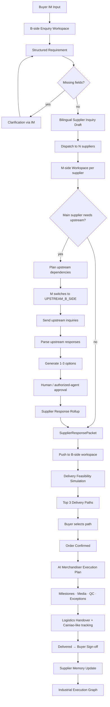

# Giraffe Agent — Product Requirements Document (PRD)

> **Project-aware, role-switching procurement execution agent for SMEs.**
> AI Buyer + AI Merchandiser + Recursive Industrial Execution Graph.

|Item                 |Value                                                                                                                                                   |
|---------------------|--------------------------------------------------------------------------------------------------------------------------------------------------------|
|Document version     |**MVP PRD v1.0 (Consolidated)**                                                                                                                         |
|Date                 |2026-05-23                                                                                                                                              |
|Status               |Source of truth for B-side MVP, M-side MVP, M-side Role-Switching Agent, Professional Free CAD↔CNC, AI Merchandiser, Logistics Ingestion, Database Layer|
|Tech stack           |Python 3.11+ · FastAPI · Pydantic v2 · SQLAlchemy 2.x · Alembic · SQLite → PostgreSQL · uv                                                              |
|Primary channels     |OpenClaw · WeChat · WhatsApp · Web fallback                                                                                                             |
|Patent owner         |Giraffe Technology Holding Limited                                                                                                                      |
|Authorization contact|**mich@giraffe.technology**                                                                                                                             |

-----

## Table of Contents

1. [Executive Summary](#1-executive-summary)
1. [Patent Notice & Licensing](#2-patent-notice--licensing)
1. [Product Positioning](#3-product-positioning)
1. [Core Concepts & Glossary](#4-core-concepts--glossary)
1. [High-Level Architecture](#5-high-level-architecture)
1. [Module 1 — B-side AI Buyer (OpenClaw Skill)](#6-module-1--b-side-ai-buyer-openclaw-skill)
1. [Module 2 — M-side Supplier Response Agent](#7-module-2--m-side-supplier-response-agent)
1. [Module 3 — M-side Role-Switching Procurement Agent](#8-module-3--m-side-role-switching-procurement-agent)
1. [Module 4 — M-side Professional Free: CAD↔CNC Matching](#9-module-4--m-side-professional-free-cadcnc-matching)
1. [Module 5 — AI Merchandiser (Post-Confirmation)](#10-module-5--ai-merchandiser-post-confirmation)
1. [Module 6 — M-side Send/Receive Role Switching](#11-module-6--m-side-sendreceive-role-switching)
1. [Module 7 — Cainiao-like Logistics Ingestion](#12-module-7--cainiao-like-logistics-ingestion)
1. [Module 8 — Database Layer](#13-module-8--database-layer)
1. [Module 9 — Dynamic Self-Learning Schema](#14-module-9--dynamic-self-learning-schema)
1. [Module 10 — Industrial Execution Graph v0.1](#15-module-10--industrial-execution-graph-v01)
1. [Repository Structure](#16-repository-structure)
1. [API Surface](#17-api-surface)
1. [Channel Integrations](#18-channel-integrations)
1. [End-to-End Reference Flows](#19-end-to-end-reference-flows)
1. [Acceptance Criteria (Master Checklist)](#20-acceptance-criteria-master-checklist)
1. [Constraints & Non-Goals](#21-constraints--non-goals)
1. [Getting Started](#22-getting-started)
1. [Testing Strategy](#23-testing-strategy)
1. [Roadmap](#24-roadmap)
1. [Contributing & Contact](#25-contributing--contact)

-----

## 1. Executive Summary

Giraffe Agent is a **project-aware, role-switching procurement execution agent** built for small and medium-sized buyers, manufacturers, and supplier networks. It is **not** a CRM, ERP, marketplace, supplier portal, or chatbot. It is the missing **execution layer** between IM-based industrial procurement and structured order delivery.

The product solves three problems that classical procurement software does not:

1. **Pre-confirmation decision support** — the **AI Buyer** structures buyer requirements from IM, drafts bilingual supplier inquiries, ingests supplier replies, and simulates Top-3 delivery paths.
1. **Recursive role switching** — a manufacturer is M-side to its buyer **and** B-side to its fabric/material/subcontract/QC/logistics suppliers in the *same* project. The agent identifies these roles per edge and rolls upstream evidence into a credible buyer-facing response.
1. **Post-confirmation execution** — the **AI Merchandiser** runs supplier acceptance, milestones, media confirmation, exceptions, logistics handover, tracking ingestion (Cainiao-like aggregator), buyer sign-off, and Supplier Memory updates.

Two execution phases:

```text
AI Buyer        = pre-confirmation decision support
AI Merchandiser = post-confirmation execution support
```

Together they form the **Industrial Execution Graph v0.1** — a project-aware, event-sourced graph that records what actually happened in the supply chain, not what was promised.

-----

## 2. Patent Notice & Licensing

### 2.1 Patent Notice (English)

Certain workflows, business methods, system designs, data structures, role-based participant coordination mechanisms, dynamic form generation mechanisms, production monitoring mechanisms, quality inspection mechanisms, participant matching mechanisms, and multi-party C2M / order execution workflows implemented or referenced by this project may be covered by patents owned by **Giraffe Technology Holding Limited**.

The relevant patent family includes, without limitation:

- **China invention patent**: ZL 2023 1 1645939.9, publication / grant number CN 117670482 B, titled *“基于多方配合的C2M模式的纺织品及服装定制运营平台系统”*.
- **Japan patent**: P7644545 / 特許第7644545号, application number P2024-57581, titled *“協働型C2Mモデルに基づく繊維及びアパレルカスタマイズ運用プラットフォームシステム”*.

### 2.2 Global Free Patent License Scope

Giraffe Technology Holding Limited grants a **free patent license, to the extent legally able**, for compliant use of the relevant patented workflows by the following users worldwide:

1. **Individuals** — independent developers, freelancers, researchers, students, personal users.
1. **Small and Medium-sized Enterprises (SMEs)** — using, deploying, adapting, localizing, or contributing for own procurement, production coordination, supplier communication, sourcing, or order execution.
1. **Educational Institutions** — schools, universities, colleges, vocational schools, teaching labs, student projects, academic training.
1. **Research Institutions** — public research institutes, nonprofit research organizations, academic labs, industrial research labs, independent research groups.

Permitted free uses include: internal deployment, modification and localization, building connectors/adapters/templates/industry knowledge packs, testing the role-switching workflow, teaching, research, prototyping, non-commercial experiments, and contributing back to the project.

### 2.3 Uses Requiring Separate Written Permission

The global free patent license **does not automatically cover**:

1. **Enterprise Deployment** — large enterprises, multinational corporations, listed companies, industrial groups, large trading platforms.
1. **Platform Operation** — marketplace, SaaS platform, cloud service, procurement platform, manufacturing network, supplier network, B2B trading platform, or order execution platform built on the patented workflow.
1. **High-volume Commercial Production Use** — high-frequency, large-scale, multi-client, revenue-generating, or production-grade commercial operation beyond ordinary SME self-use.
1. **System Integration for Third Parties** — commercial integration, customization, managed service provision for third-party clients.
1. **White-label / OEM / Resale** — repackaging, reselling, white-labeling, sublicensing.
1. **Enterprise CAP / Confidential Engineering File Services** — enterprise-grade confidential artifact protection, secure CAD/STEP/BOM rooms, VPC deployment, dynamic watermarking, no-download rooms.
1. **Use of Giraffe Commercial Assets** — Giraffe trademarks, supplier network, buyer data, transaction data, order archives, Industrial Execution Graph data, or proprietary business data.

For authorization outside the free scope, contact: **mich@giraffe.technology**

### 2.4 Open Source Boundary

Source code may be released under open-source licenses as specified in the repository. However, access to the source code **does not automatically grant**: Giraffe patents outside the free license scope, trademarks/brand, supplier network data, buyer/transaction data, order archives, Industrial Execution Graph data, commercial operating rights, enterprise deployment rights, platform operating rights, or sublicensing rights.

Open-source code access and patent permission are **separate legal layers**.

### 2.5 专利提示（中文）

本项目中的部分工作流、系统逻辑、参与者协同机制、动态表单机制、生产监控机制、质量检测机制、角色切换式采购执行流程及多方 C2M / 订单执行流程，可能涉及长颈鹿科技（控股）有限公司拥有的相关专利，包括中国发明专利 **ZL 2023 1 1645939.9 / CN 117670482 B** 及日本专利 **P7644545 / 特許第7644545号**。

长颈鹿科技（控股）有限公司向全球范围内的**个人、中小企业（SME）、教育机构及科研机构**，就合规使用相关专利工作流与系统逻辑授予**免费专利许可**。企业级部署、平台化运营、大规模商业生产使用、为第三方提供系统集成或托管服务、白标/OEM/转售、Enterprise CAP、以及使用长颈鹿商标、供应商网络、买方数据、交易数据、订单档案、Industrial Execution Graph 数据或商业运营权，须**另行取得书面许可**。

取得本项目开源代码，并不当然取得超出上述免费专利许可范围之外的任何专利权、商标权、商业运营权、数据权利或平台运营权。

授权联系：**mich@giraffe.technology**

### 2.6 Required Patent Notice Files

Implementations MUST create or maintain:

```text
README.md
LICENSE_NOTICE.md
PATENT_NOTICE.md
src/legal/patent_notice.py
```

The `legal_notices` database table MUST seed the bilingual patent notice (see [§13.16](#1316-legal-notice)).

-----

## 3. Product Positioning

### 3.1 What Giraffe Agent Is

A real, runnable **MVP procurement execution agent** with two phases and one shared graph:

|Phase                   |Module                             |Trigger                         |Output                                                                    |
|------------------------|-----------------------------------|--------------------------------|--------------------------------------------------------------------------|
|Pre-confirmation        |**AI Buyer**                       |Buyer IM message / RFQ          |Structured requirement → Bilingual supplier inquiry → Top-3 delivery paths|
|Recursive role switching|**M-side Agent**                   |Inquiry receipt by main supplier|Upstream inquiries → Options (1–3) → Approved Supplier Response Rollup    |
|Post-confirmation       |**AI Merchandiser**                |Buyer order confirmation        |Milestones, media, exceptions, logistics, sign-off, Supplier Memory       |
|Cross-cutting           |**Industrial Execution Graph v0.1**|Every state transition          |Append-only event log + procurement edges                                 |

### 3.2 What Giraffe Agent Is Not (for MVP)

- Not a full M-side supplier ERP / MES / QMS.
- Not a supplier marketplace, no marketplace listings.
- Not a payment, escrow, wallet, or settlement system.
- Not Enterprise CAP (no file encryption, dynamic watermarking, secure viewer, no-download room, VPC).
- Not a production-grade factory operating system.
- Not a generic chatbot.
- Not a static investor demo.

### 3.3 Required Product Vocabulary

These terms MUST be used consistently in code, comments, docs, UI, and tests:

- **B-side MVP** / **AI Buyer**
- **M-side MVP** / **AI Merchandiser** / **Supplier Response Agent**
- **OpenClaw-compatible skill**
- **IM-native buyer / supplier workflow**
- **Enquiry Workspace** / **Supplier Workspace**
- **StructuredRequirement** / **SupplierInquiryDraft**
- **SupplierResponsePacket** / **SupplierResponseRollup**
- **Delivery Feasibility Simulation** / **B-side Feasibility Report**
- **Capacity Signal / Schedule Signal / Material Availability / Quote Readiness**
- **Production Update / QC Confirmation / Exception Report / Logistics Handover**
- **CAD Requirement Packet** / **Capability Fit Report** / **Manufacturing Feature Set**
- **Role Context** / **Procurement Edge** / **Project Graph**
- **Industrial Execution Graph v0.1 seed**
- **Professional Free** / **Enterprise CAP** (the latter is out of MVP scope)

Do **not** call the product a “demo” except when explicitly referring to seed fixtures or QA scenarios.

-----

## 4. Core Concepts & Glossary

### 4.1 Non-Negotiable Product Principle

> **Do not treat B-side and M-side as fixed identities.** An actor’s role is contextual — it depends on the project, the procurement edge, the counterparty, the current inquiry, and the current workspace.

The same company may be:

- M-side supplier to its buyer.
- B-side buyer to its upstream material suppliers.
- B-side buyer to its subcontractors.
- B-side buyer to packaging, QC, or logistics providers.

Every workflow MUST be **project-aware** and **edge-aware**.

### 4.2 Actor Model

|Concept          |Definition                                                                                                                   |
|-----------------|-----------------------------------------------------------------------------------------------------------------------------|
|`Actor`          |Neutral participant (company / person / factory). `actor_type` describes nature only; it does **not** determine project role.|
|`Project`        |Procurement intent owned by an `original_buyer_actor_id` with one `main_supplier_actor_id`.                                  |
|`ProcurementEdge`|Directed buyer→supplier or supplier→upstream relationship. Edges may nest via `parent_edge_id`.                              |
|`RoleContext`    |Per-project, per-edge, per-actor role resolution. Same actor can have many.                                                  |
|`ExecutionEvent` |Append-only event for every meaningful state transition.                                                                     |

### 4.3 The Five Role Types

```text
ORIGINAL_BUYER       # who started the project
MAIN_M_SIDE          # main supplier to the original buyer
UPSTREAM_B_SIDE      # main supplier acting as buyer to its own upstream
UPSTREAM_M_SIDE      # an upstream supplier responding to the main supplier
QC_SIDE / LOGISTICS_SIDE
SYSTEM / UNKNOWN
```

**Example — 100-shirt project:**

```text
Buyer B → Manufacturer M
  Manufacturer M is MAIN_M_SIDE to Buyer B.

Manufacturer M → Fabric Supplier F1
  Manufacturer M is UPSTREAM_B_SIDE to Fabric Supplier F1.
  Fabric Supplier F1 is UPSTREAM_M_SIDE to Manufacturer M.
```

### 4.4 Two Execution Phases

```text
AI Buyer (pre-confirmation):
  buyer input → requirement structuring → supplier inquiry → supplier response
  → delivery feasibility simulation → Top 3 delivery paths

AI Merchandiser (post-confirmation):
  order confirmation → supplier acceptance → production milestones
  → upstream follow-up → QC/media confirmation → exception handling
  → logistics handover → tracking → delivery → buyer sign-off
  → supplier memory update
```

M-side role switching is the **bridge** between the two phases.

-----

## 5. High-Level Architecture

### 5.1 Six-Layer System

```text
┌─────────────────────────────────────────────────────────────────────┐
│ IM / OpenClaw Layer                                                 │
│   OpenClaw skill manifest + invocation                              │
│   WeChat / WhatsApp / Line / Email adapters                         │
│   Web workspace fallback (QA only)                                  │
├─────────────────────────────────────────────────────────────────────┤
│ Conversation Orchestration Layer                                    │
│   Session resolution · Workspace create/resume                      │
│   Role-aware IM router · Intent routing                             │
│   Clarification state handling · Response formatting                │
├─────────────────────────────────────────────────────────────────────┤
│ Workflow Layer                                                      │
│   B-side: AI Buyer (requirement → inquiry → feasibility)            │
│   M-side: Supplier Response Agent + Role-Switching Agent            │
│   M-side: Professional Free CAD↔CNC matching                        │
│   AI Merchandiser: milestones · media · exceptions · logistics      │
│   Cainiao-like logistics ingestion                                  │
├─────────────────────────────────────────────────────────────────────┤
│ Bridge Layer                                                        │
│   Inquiry Dispatcher (B→M) · Response Bridge (M→B)                  │
│   Order Bridge · Upstream Bridge · Rollup Submission                │
├─────────────────────────────────────────────────────────────────────┤
│ Persistence Layer                                                   │
│   SQLite (local) / PostgreSQL (prod-portable)                       │
│   Actors · Projects · Edges · RoleContexts · Requirements           │
│   Inquiries · Responses · Rollups · Milestones · Shipments          │
│   Artifacts · Dynamic Schema · Supplier Memory                      │
├─────────────────────────────────────────────────────────────────────┤
│ Industrial Execution Graph v0.1                                     │
│   Append-only ExecutionEvent log + procurement_edges                │
└─────────────────────────────────────────────────────────────────────┘
```

### 5.2 End-to-End Flow Diagram



-----

## 6. Module 1 — B-side AI Buyer (OpenClaw Skill)

The B-side MVP is the first product surface. It MUST be deployable as an OpenClaw-compatible skill and accept IM input from WeChat / WhatsApp (with mock fallback) and a web workspace.

### 6.1 Minimum Buyer Loop

1. Buyer sends product requirement through OpenClaw / WeChat / WhatsApp / Web.
1. System creates or resumes an **Enquiry Workspace**.
1. System converts the message into a **StructuredRequirement**.
1. System identifies missing fields and asks one-at-a-time IM clarification questions.
1. Buyer answers; the StructuredRequirement is updated.
1. System generates a **bilingual SupplierInquiryDraft**.
1. Buyer can dispatch to suppliers manually (or via M-side bridge).
1. Buyer can paste supplier replies back through IM or Web; system normalizes them.
1. System runs **Delivery Feasibility Simulation**.
1. System returns **Top-3 delivery paths** with score breakdown, red flags, rationale, recommended next action.
1. System exports a buyer-facing report as Markdown and JSON.

### 6.2 Core Pydantic Models (`src/core_schema/b_side_types.py`)

Models include `StructuredRequirement`, `ClarificationQuestion`, `ClarificationAnswer`, `SupplierInquiryDraft`, `DeliveryPath`, `FeasibilityReport`, `BSideWorkspace`.

Workspace status machine:

```text
created → requirement_structured → clarification_pending → clarification_completed
→ inquiry_drafted → supplier_responses_pending → supplier_responses_received
→ feasibility_generated → report_exported → closed
```

### 6.3 Workflow Hint Mapping

```text
garment / apparel / fabric            → apparel_b2m
cnc / machining / precision / bracket → cnc_precision
packaging / box / hardware / fastener → packaging_hardware
otherwise                              → general
```

### 6.4 Feasibility Scoring Dimensions

|Dimension            |Weight|
|---------------------|------|
|quote_completeness   |0.20  |
|lead_time_credibility|0.25  |
|material_readiness   |0.20  |
|capacity_readiness   |0.15  |
|qc_readiness         |0.10  |
|logistics_risk       |0.05  |
|confidentiality_risk |0.05  |

Scoring MUST be deterministic. LLM reasoning is only an explainability layer.

### 6.5 Bilingual Supplier Inquiry Template

Chinese template (mirror in English):

```text
【Giraffe Agent 询盘】
询盘编号：{rfq_id}
产品：{product_category} — {product_description}
数量：{quantity} {unit}
材料：{material}
规格/工艺：{dimensions_or_specs}; {process_requirements}
交货：{destination}，{target_delivery_date}前
保密级别：L{cap_level}

请回复以下信息：
1. 是否可以接单？
2. 报价
3. 最小起订量 (MOQ)
4. 产能状态
5. 物料备货情况
6. 生产周期
7. 打样周期（如需）
8. 质检方式
9. 物流方式 (EXW / FOB / DDP)
10. 主要风险或备注
```

-----

## 7. Module 2 — M-side Supplier Response Agent

The M-side MVP must allow SME suppliers to receive buyer enquiries and respond through IM-native channels — WeChat, WhatsApp, OpenClaw, or the web fallback.

### 7.1 Minimum Supplier Loop

1. Receive a buyer inquiry through OpenClaw / WeChat / WhatsApp / Web.
1. Open or resume a supplier-side workspace.
1. Confirm capacity, schedule, material, quote, MOQ, lead time, QC, packaging, logistics, risks.
1. Submit a **SupplierResponsePacket** back to the B-side workspace.
1. If selected, acknowledge the order and submit production / QC / logistics updates.
1. Report exceptions; confirm completion.
1. All events logged to the Industrial Execution Graph.

### 7.2 Supplier Workspace States

```text
inquiry_received → supplier_identified → clarification_pending → response_collecting
→ response_draft_ready → response_submitted_to_b_side → selected_by_buyer
→ order_acknowledgement_pending → order_acknowledged → in_production
→ qc_pending → ready_for_logistics → shipped → completed
→ (exception_reported / closed)
```

### 7.3 Supplier Identity Modes

1. **Known supplier mode** — supplier exists in `supplier_profiles` with channel + external user ID.
1. **Invitation token mode** — supplier receives a short token (e.g., `GIRAFFE-M-8K2Q`, `GQ-7421`).
1. **Manual mapping mode** — operator maps supplier name → workspace.

Supplier can reply `接受 GQ-7421` / `Accept GQ-7421` to bind their IM session.

### 7.4 SupplierResponsePacket Structure

```python
class SupplierResponsePacket(BaseModel):
    response_id: str
    m_workspace_id: str
    b_workspace_id: str
    rfq_id: str
    inquiry_id: str
    supplier_id: str
    supplier_name: str
    submitted_at: datetime
    raw_supplier_messages: list[str]
    capacity_signal: CapacitySignal
    schedule_signal: ScheduleSignal
    material_availability: MaterialAvailability
    quote: SupplierQuote
    qc_commitment: QCCommitment
    logistics_commitment: LogisticsCommitment
    red_flags: list[str]
    assumptions: list[str]
    completeness_score: float
    confidence_score: float
    supplier_summary_for_buyer: str
```

### 7.5 Natural-Language Parsing Requirements

Minimum deterministic parsing support:

- Currencies: RMB / CNY / USD / EUR / HKD
- Lead time: `days`, `weeks`, `日期`
- MOQ, can/cannot make, material available/unavailable
- Outsourcing risk, tooling fee, sample fee
- QC / photo / video capability
- Logistics terms: EXW / FOB / DDP / courier / sea / air
- Red flag phrases: *uncertain, maybe, cannot confirm, material shortage, outsourcing, holiday delay, over capacity*

**If parsing is uncertain, ask one more clarification question — never invent data.**

Example supplier reply that must parse cleanly:

```text
可以做，6061材料有现货，最快下周三开工，样品7天，大货25天，
单价4.8美元，MOQ 500，阳极氧化要外协，可能多3天。
```

-----

## 8. Module 3 — M-side Role-Switching Procurement Agent

This is the **core differentiator** of Giraffe Agent.

### 8.1 The Problem It Solves

> Buyer B orders 100 shirts from Manufacturer M. To answer credibly, Manufacturer M must ask multiple fabric, trim, packaging, subcontract, QC, and logistics suppliers. In those upstream inquiries, M becomes B-side. The agent collects upstream responses, generates 1–3 options, obtains approval, and rolls the approved evidence into M’s buyer-facing response.

### 8.2 Main Supplier Workflow

When Manufacturer M receives an inquiry from Buyer B, the M-side agent MUST:

1. Resolve Manufacturer M as `MAIN_M_SIDE`.
1. Parse the buyer requirement.
1. Determine whether M can answer internally.
1. Identify upstream dependencies via the **Dependency Planner**.
1. Ask M whether to contact upstream / subcontractor suppliers.
1. Generate **UpstreamInquiry** records (bilingual EN/ZH).
1. Dispatch them via configured channels.
1. Parse upstream responses into **UpstreamResponse** records.
1. Generate **1–3 UpstreamOption** entries per dependency: `BEST`, `FASTEST`, `SAFEST`, `LOWEST_COST`, `BACKUP`.
1. Request human (default) or authorized-agent approval.
1. Generate **SupplierResponseRollup**.
1. Submit the rollup back to the B-side workspace.

### 8.3 DependencyNeed Types

```text
fabric · trim · raw_material · component · subcontract_process
surface_treatment · heat_treatment · qc_testing · packaging · logistics
tooling · fixture · capacity
```

For the 100-shirt example, the planner MUST identify at minimum: fabric, trim/buttons, packaging, sewing capacity if outsourced, QC if required, logistics if destination/deadline affects feasibility.

### 8.4 Approval Gate Rules

- Default approval mode: **human approval**.
- Authorized agent approval allowed only if `AUTO_APPROVAL_ENABLED=true`.
- Medium or high risk options **always** require human approval.
- The system MUST NOT roll up unapproved upstream options into the buyer-facing response.

### 8.5 SupplierResponseRollup

The rollup MUST clearly state:

- What M can do internally.
- Which upstream dependencies were confirmed and which option was approved.
- Which dependencies are unresolved.
- What delivery promise can be credibly made to Buyer B.
- What risks require buyer confirmation.

### 8.6 IM Interaction Snippets

When M receives a buyer inquiry:

```text
Giraffe Agent:
Buyer B is asking whether you can produce 100 shirts.
Your role in this project: M-side supplier to Buyer B.

To respond credibly, we need to confirm:
1. Fabric  2. Trims/buttons  3. Packaging  4. Sewing capacity  5. QC  6. Logistics

Would you like Giraffe to ask upstream suppliers now?
A. Ask selected upstream suppliers
B. Edit upstream supplier list
C. Reply based on internal estimate only
```

When fabric options are ready:

```text
Giraffe Agent: Fabric options are ready.

Option 1 — Best Overall    Supplier: F1 / Price / Lead time / MOQ / Risk
Option 2 — Fastest         Supplier: F2 / ...
Option 3 — Backup          Supplier: F3 / ...

Approve one option, ask for more quotes, or edit assumptions?
```

-----

## 9. Module 4 — M-side Professional Free: CAD↔CNC Matching

Professional Free is a free, professional-grade tier that lets SME manufacturers compare buyer CAD/STEP/PDF/BOM requirements against their own CNC / machining-center capability — **without** Enterprise CAP file protection.

### 9.1 Workflow

```text
Buyer B uploads CAD / STEP / PDF / BOM / engineering requirement
→ Giraffe creates CADRequirementPacket
→ M receives inquiry as MAIN_M_SIDE
→ Embedded MachinaCheck-like feature extractor produces ManufacturingFeatureSet
→ CAD-to-CNC matcher compares against ShopCapabilityProfile
→ CapabilityFitReport is generated
→ If gaps exist, dependency planner creates upstream / subcontractor inquiries
→ Supplier Response Rollup includes CAD-to-CNC evidence
→ Pushed back to B-side feasibility engine
```

### 9.2 Product Flags

```python
PROFESSIONAL_FREE_FEATURES = {
    "cad_requirement_packet": True,
    "machinacheck_embedded_mock": True,
    "cad_cnc_parameter_matching": True,
    "machine_profile_matching": True,
    "supplier_response_rollup": True,
    "role_switching_upstream_inquiry": True,
    "basic_audit_log": True,

    # Explicitly disabled — Enterprise CAP territory
    "file_encryption": False,
    "dynamic_watermark": False,
    "secure_viewer": False,
    "no_download_room": False,
    "vpc_deployment": False,
    "enterprise_cap": False,
}
```

### 9.3 Mandatory File Warning

Before any CAD/STEP/BOM handling, show:

> Professional Free does not provide encrypted file protection or Enterprise CAP. Do not upload highly confidential CAD / STEP / BOM files. Use Enterprise CAP for confidential engineering documents.

Audit events: `FILE_REFERENCE_CREATED`, `PROFESSIONAL_FREE_FILE_WARNING_SHOWN`, `CAD_REQUIREMENT_PACKET_CREATED`, `PROFESSIONAL_FREE_CAP_LIMITATION_ACKNOWLEDGED`.

### 9.4 Match Result Dimensions

`CADCNCMachiningMatchResult` reports each as `fit` / `marginal` / `requires_external_process` / `not_fit` / `unknown`:

|Dimension           |Possible Values                                    |
|--------------------|---------------------------------------------------|
|`work_envelope_fit` |fit / not_fit / unknown                            |
|`material_fit`      |in_stock / purchasable / not_supported / unknown   |
|`tolerance_fit`     |fit / marginal / not_fit / unknown                 |
|`surface_finish_fit`|fit / requires_external_process / not_fit / unknown|
|`tooling_fit`       |fit / setup_required / missing / unknown           |
|`qc_fit`            |fit / external_qc_required / missing / unknown     |
|`schedule_fit`      |fit / limited / not_fit / unknown                  |

### 9.5 Matching → Dependency Generation Rules

```text
material_fit == purchasable                 → material supplier inquiry
surface_finish_fit == requires_external_…   → surface treatment subcontractor inquiry
qc_fit == external_qc_required              → QC provider inquiry
schedule_fit == limited                     → backup subcontractor inquiry
work_envelope_fit == not_fit                → subcontractor inquiry
tolerance_fit == marginal                   → QC / process review inquiry
tooling_fit == setup_required               → tooling supplier or setup confirmation
```

### 9.6 Sample Buyer-Facing Capability Response

```text
We can quote this part based on our current 3-axis CNC capability, but material
confirmation and external surface treatment are required before final lead-time
commitment. The CAD requirement fits our work envelope and typical tolerance range.
QC is available in-house for standard inspection; tighter inspection requires
external QC confirmation.
```

-----

## 10. Module 5 — AI Merchandiser (Post-Confirmation)

After buyer order confirmation, the AI Merchandiser drives execution. Deployed on **both B-side and M-side** with a shared engine.

### 10.1 Order Execution State Machine

```text
ORDER_CONFIRMED → SUPPLIER_ACCEPTANCE_PENDING → SUPPLIER_ACCEPTED
→ PRODUCTION_PLAN_CREATED → MATERIAL_CONFIRMATION_PENDING → MATERIAL_CONFIRMED
→ PRODUCTION_STARTED → MILESTONE_PENDING → MILESTONE_MEDIA_REQUESTED
→ MILESTONE_MEDIA_UPLOADED → MILESTONE_BUYER_REVIEW_PENDING → MILESTONE_CONFIRMED
→ QC_PENDING → QC_CONFIRMED → PACKAGING_PENDING → PACKAGING_CONFIRMED
→ LOGISTICS_HANDOVER_PENDING → LOGISTICS_HANDOVER_RECEIVED
→ IN_TRANSIT → CUSTOMS → OUT_FOR_DELIVERY → DELIVERED
→ BUYER_SIGNOFF_PENDING → BUYER_SIGNED_OFF → ORDER_CLOSED

EXCEPTION_RAISED → EXCEPTION_RESOLUTION_PENDING → EXCEPTION_RESOLVED
CANCELLED
```

### 10.2 Side Router — Same Event, Different Messages

Event: `material_delay_reported`

**B-side message (buyer-facing, English):**

> The supplier reported a fabric delay. Two options are available: wait 3 extra days or switch to backup fabric.

**M-side message (supplier-facing, Chinese):**

```text
请确认是否采用备用布料方案，或继续等待原布料。若影响交期，请说明新的预计完成时间。
```

### 10.3 Milestone Plans

**Apparel / shirt:**

```text
material_arrival → cutting → assembly → in_process_qc → final_qc
→ packaging → logistics_handover → delivery
```

**CNC / machining:**

```text
material_confirmation → machining → surface_treatment (if required) → final_qc
→ packaging → logistics_handover → delivery
```

### 10.4 Exception Manager — Autonomy Rules

|Exception type                                                                               |Autonomy                                       |
|---------------------------------------------------------------------------------------------|-----------------------------------------------|
|Low-risk reminders                                                                           |May be automatic                               |
|Material change, price change, delivery-promise change, quality dispute, cancellation, refund|**Requires buyer confirmation or human review**|
|M-side may propose resolution options; buyer-impacting changes must be confirmed by B-side   |—                                              |

### 10.5 B-side Example Messages

```text
Your order is now in production. The supplier has confirmed fabric arrival
and cutting is scheduled for tomorrow.

Milestone confirmation required:
The supplier uploaded 3 photos for the cutting stage.
Reply: A. Confirm  B. Request more photos  C. Raise issue

The shipment has been delivered according to logistics data. Please confirm receipt:
A. Confirm received  B. Not received  C. Received with issue
```

### 10.6 M-side Example Messages

```text
老板，订单 SHIRT-100 已确认。今天需要确认布料是否到仓。请回复：
A. 已到仓  B. 未到仓  C. 有问题，需要说明

请上传裁剪阶段照片：正面、背面、细节各一张。拍清楚一点，方便 buyer 确认。

订单已到物流交接阶段。请回复物流公司、运单号，并上传面单照片。
例如：已发顺丰，单号 SF123456789，今天下午发出。
```

-----

## 11. Module 6 — M-side Send/Receive Role Switching

M is not only switching business roles; M is also switching **communication direction**.

### 11.1 Three Communication Directions × Five Business Roles

```python
CommunicationDirection = Literal["INBOUND", "OUTBOUND", "INTERNAL"]
```

M’s possible posture in a project:

|#|Business Role    |Direction|Purpose                                          |
|-|-----------------|---------|-------------------------------------------------|
|1|`MAIN_M_SIDE`    |INBOUND  |Receives inquiry from Buyer B                    |
|2|`UPSTREAM_B_SIDE`|OUTBOUND |Sends inquiries to upstream suppliers            |
|3|`UPSTREAM_B_SIDE`|INBOUND  |Receives upstream supplier replies               |
|4|`MAIN_M_SIDE`    |OUTBOUND |Sends Supplier Response Rollup to Buyer B        |
|5|`MAIN_M_SIDE`    |EXECUTION|Coordinates production, QC, logistics, exceptions|

### 11.2 RoleSwitchFrame

Every inbound and outbound message MUST be attached to a `RoleSwitchFrame`:

```python
RoleSwitchFrame
- frame_id, project_id
- actor_id, counterparty_actor_id
- edge_id, role_context_id
- business_role, communication_direction
- message_purpose
- conversation_thread_id, parent_frame_id
- created_at
```

### 11.3 MessagePurpose Taxonomy

```text
buyer_inquiry_received · main_supplier_clarification_to_buyer
upstream_inquiry_to_supplier · upstream_response_received
upstream_option_approval_request · supplier_response_rollup_to_buyer
buyer_rollup_confirmation · production_progress_update
media_upload_request · qc_update · logistics_handover · tracking_update
buyer_signoff_request · buyer_signoff_response · exception_report
system_reminder · unknown
```

### 11.4 Conversation Thread Types

```text
buyer_main_supplier            # Buyer ↔ Main Supplier
main_supplier_upstream         # Main Supplier ↔ Upstream
main_supplier_internal_approval# Internal approval workflow
buyer_rollup_review            # Rollup review back to buyer
production_progress · media_confirmation · logistics_handover
logistics_tracking_update · exception_resolution · buyer_signoff
```

### 11.5 Routing Rules

1. Message from original buyer thread → `MAIN_M_SIDE / INBOUND` → `buyer_requirement_parser` / `buyer_confirmation_parser`.
1. Message from upstream supplier thread → `UPSTREAM_B_SIDE / INBOUND` → `upstream_response_parser`.
1. Internal approval from M → `INTERNAL` → `approval_parser`.
1. Tracking number from M-side execution thread → `MAIN_M_SIDE` → `logistics_parser`.
1. Buyer delivery confirmation → `ORIGINAL_BUYER` → `buyer_signoff_parser`.
1. Low confidence → create clarification task; do not auto-update buyer-facing response.

### 11.6 Outbox Approval Rules

- **Upstream inquiries** require M approval by default.
- **Buyer-facing rollups** require M approval.
- Low-risk production reminders MAY auto-send if explicitly allowed.
- Any **price, lead time, material change, QC risk, or buyer-facing commitment** requires approval.

### 11.7 Correlation Tokens

Every outbound upstream inquiry stores a correlation token, e.g.:

```text
GFR-PROJ-shirt100-DEP-fabric-F1
```

Purpose: match upstream replies to the correct project + dependency; support free-text WeChat/WhatsApp replies; avoid confusion across similar inquiries.

-----

## 12. Module 7 — Cainiao-like Logistics Ingestion

Logistics data is **API-ingestion first**. Manual entry and mock provider are fallback modes.

### 12.1 Main Production Path

```text
M-side supplier provides carrier + tracking number
→ Giraffe creates LogisticsShipment
→ Giraffe calls Cainiao-like logistics aggregator API
→ API returns tracking events
→ Giraffe normalizes events
→ Giraffe updates order state
→ Giraffe pushes B-side logistics updates
→ Giraffe records events into Industrial Execution Graph
```

**Delivered status does NOT automatically equal buyer acceptance.** Delivered triggers a buyer sign-off request.

### 12.2 Provider Abstraction

```python
class LogisticsProviderBase:
    provider_name: str

    def create_or_bind_shipment(self, carrier_code, tracking_number, metadata) -> dict: ...
    def fetch_tracking_events(self, carrier_code, tracking_number) -> list[dict]: ...
    def parse_webhook_payload(self, payload, headers) -> list[dict]: ...
    def verify_webhook_signature(self, payload, headers) -> bool: ...
    def normalize_event(self, raw_event) -> dict: ...
```

Implementations: `MockProvider`, `CainiaoLikeProvider`. Provider registry switches by env var.

### 12.3 Environment Variables

```text
# Local MVP
LOGISTICS_PROVIDER=mock
LOGISTICS_API_ENABLED=false

# Production switch
LOGISTICS_PROVIDER=cainiao_like
LOGISTICS_API_ENABLED=true
CAINIAO_LIKE_ENABLED=true
CAINIAO_LIKE_API_BASE_URL=
CAINIAO_LIKE_APP_KEY=
CAINIAO_LIKE_APP_SECRET=
CAINIAO_LIKE_ACCESS_TOKEN=
CAINIAO_LIKE_SIGNING_METHOD=hmac_sha256
CAINIAO_LIKE_TIMEOUT_SECONDS=10
CAINIAO_LIKE_MAX_RETRIES=3
CAINIAO_LIKE_WEBHOOK_SECRET=

LOGISTICS_POLL_INTERVAL_MINUTES=60
LOGISTICS_USE_WEBHOOKS=false
LOGISTICS_ENABLE_MANUAL_FALLBACK=true
```

### 12.4 Carrier Mapping

```python
{
  "顺丰": "SF",   "SF Express": "SF",
  "中通": "ZTO",  "圆通": "YTO",
  "申通": "STO",  "韵达": "YD",
  "EMS": "EMS",   "DHL": "DHL",
  "FedEx": "FEDEX", "UPS": "UPS",
}
```

(Not exhaustive — configuration-driven.)

### 12.5 IM Text → Logistics Info Extraction

```text
"已发顺丰，单号 SF123456789，今天下午发出"
→ { carrier_name:"顺丰", carrier_code:"SF", tracking_number:"SF123456789" }

"DHL shipped today, tracking no. 1234567890"
→ { carrier_name:"DHL", carrier_code:"DHL", tracking_number:"1234567890" }
```

### 12.6 Normalized Status Vocabulary

```text
label_created · picked_up · in_transit · customs
out_for_delivery · delivered · exception · unknown
```

Chinese / English mapping:

```text
已揽收/picked up      → picked_up
运输中/in transit     → in_transit
清关中/customs clearance → customs
派送中/out for delivery  → out_for_delivery
已签收/delivered      → delivered
异常/delivery exception  → exception
```

### 12.7 Idempotency & Dedup

Event hash key:

```text
shipment_id + provider_name + tracking_number + normalized_status
+ event_time + location + description_hash
```

Duplicate → write `LOGISTICS_EVENT_DEDUPED` event; do not create another record; still update `last_synced_at` if appropriate.

### 12.8 Status → Order State Mapping

```text
label_created     → LOGISTICS_HANDOVER_RECEIVED
picked_up         → IN_TRANSIT
in_transit        → IN_TRANSIT
customs           → CUSTOMS (or IN_TRANSIT with customs note)
out_for_delivery  → OUT_FOR_DELIVERY
delivered         → DELIVERED  AND  BUYER_SIGNOFF_PENDING
exception         → EXCEPTION_RAISED
```

### 12.9 Security Constraints

- Webhook signature verification MUST be enforced in production mode.
- Signature bypass is allowed **only** in local MVP mock mode.
- Only send the logistics provider: **carrier, tracking number, logistics-related reference**. Do **not** send confidential CAD/BOM/order documents.

-----

## 13. Module 8 — Database Layer

The database is **project-aware** and PostgreSQL-portable. SQLite for local MVP. All tables use string UUID primary keys; timezone-aware timestamps; `metadata_json` instead of `metadata` to avoid SQLAlchemy conflicts.

### 13.1 Tech Stack

```text
Python 3.11+  ·  SQLAlchemy 2.x  ·  Alembic
Pydantic v2   ·  SQLite local    ·  PostgreSQL-compatible schema
JSON columns (map to JSONB on Postgres)
```

### 13.2 Mixins

```python
UUIDPrimaryKeyMixin
TimestampMixin
SoftDeleteMixin
MetadataJSONMixin
```

### 13.3 Core Tables (selected — full list in `src/db/models/`)

|Table              |Purpose                                                                                 |
|-------------------|----------------------------------------------------------------------------------------|
|`actors`           |Neutral participants (`actor_type` describes nature, **not** project role).             |
|`projects`         |Procurement projects with original buyer, optional main supplier, status, product tier. |
|`procurement_edges`|Directed buyer→supplier / supplier→upstream relationships with `parent_edge_id` nesting.|
|`role_contexts`    |Per-project, per-edge, per-actor role assignment (same actor can have many).            |

### 13.4 B-side Tables

|Table                    |Key Fields                                                                                                                        |
|-------------------------|----------------------------------------------------------------------------------------------------------------------------------|
|`structured_requirements`|`requirement_id`, `project_id`, `specs_json`, `missing_fields_json`, `confidence_score`                                           |
|`supplier_inquiries`     |`inquiry_id`, `edge_id`, `from_actor_id`, `to_actor_id`, bilingual message text, `requested_fields_json`                          |
|`supplier_responses`     |`response_id`, `edge_id`, `can_supply`, `price`, `lead_time_days`, `capacity_basis_json`, `material_basis_json`, `risk_flags_json`|

### 13.5 M-side Upstream Tables

|Table               |Key Fields                                                                                         |
|--------------------|---------------------------------------------------------------------------------------------------|
|`dependency_needs`  |`dependency_id`, `dependency_type`, `required_specs_json`, `risk_level`, `candidate_actor_ids_json`|
|`upstream_inquiries`|`upstream_inquiry_id`, `parent_main_supplier_actor_id`, `upstream_actor_id`, bilingual text        |
|`upstream_responses`|`upstream_response_id`, `can_supply`, `matched_specs_json`, `risk_flags_json`                      |
|`upstream_options`  |`option_id`, `option_label` (BEST/FASTEST/SAFEST/LOWEST_COST/BACKUP), `score`, `response_ids_json` |
|`approval_requests` |`approval_request_id`, `approval_mode`, `status`, `approved_option_id`                             |

### 13.6 Supplier Response Rollup

`supplier_response_rollups` — Main supplier’s final structured response back to B-side. Includes upstream evidence and (when present) CAD-to-CNC capability evidence. Key fields:

```text
rollup_id, project_id, main_supplier_actor_id
can_accept_order, main_capacity_summary
approved_upstream_options_json
material_basis_json, trim_basis_json, subcontract_basis_json
qc_basis_json, packaging_basis_json, logistics_basis_json
price_basis_json, lead_time_basis_json
unresolved_dependencies_json, risk_flags_json
completeness_score, confidence_score
recommended_response_to_buyer_en, recommended_response_to_buyer_zh

# CAD-to-CNC enhancement
cad_requirement_packet_id, cad_cnc_match_id, capability_fit_report_id
cnc_parameter_match_summary_json, can_make_in_house
recommended_machine_ids_json, capability_gaps_json
upstream_dependency_basis_json
```

### 13.7 CAD / CNC / MachinaCheck-like Tables

|Table                       |Purpose                                                                                                           |
|----------------------------|------------------------------------------------------------------------------------------------------------------|
|`artifacts`                 |Files (`cad`, `step`, `pdf`, `bom`, `image`, …) with `product_tier`, `encryption_enabled`, `warning_acknowledged`.|
|`cad_requirement_packets`   |Extracted buyer engineering requirements.                                                                         |
|`manufacturing_feature_sets`|Embedded MachinaCheck-like output: required processes, axis count, work envelope, tolerance class, etc.           |
|`shop_capability_profiles`  |Manufacturer’s machines, tooling, QC equipment, material inventory, schedule.                                     |
|`cad_cnc_match_results`     |The 7 fit dimensions + required dependencies + confidence + explanation.                                          |
|`capability_fit_reports`    |Buyer-facing bilingual summary + internal summary.                                                                |

### 13.8 Professional Free Rule (Artifact Defaults)

When `product_tier = professional_free`:

```text
encryption_enabled = false
dynamic_watermark_enabled = false
secure_viewer_enabled = false
warning_acknowledged MUST be true before CADRequirementPacket creation
```

### 13.9 AI Merchandiser Tables (additions)

|Table                 |Purpose                                                                             |
|----------------------|------------------------------------------------------------------------------------|
|`conversation_threads`|Thread context: project, edge, channel_type, thread_type, status, correlation_token.|
|`role_switch_frames`  |Per-message role+direction+purpose+thread linkage.                                  |
|`outbound_messages`   |Draft → approval → ready → sent → failed.                                           |
|`inbound_messages`    |Raw + parsed_target + parsed_result + confidence + status.                          |
|`merchandiser_tasks`  |Side-assigned tasks (B/M/UPSTREAM_M/SYSTEM).                                        |
|`order_milestones`    |Type, sequence, expected/actual times, evidence requirements.                       |
|`media_evidence`      |Image / video / document / shipping_label per milestone with buyer review status.   |
|`order_exceptions`    |Type, severity, options, autonomy flags.                                            |

### 13.10 Logistics Tables

|Table                |Purpose                                                                                   |
|---------------------|------------------------------------------------------------------------------------------|
|`logistics_shipments`|Provider, carrier, tracking number, current status, dates, sync status.                   |
|`logistics_events`   |Per-event normalization, dedup hash, source (api/webhook/im/uploaded_receipt/mock/manual).|

### 13.11 IM / Messaging Tables

|Table             |Purpose                                                                               |
|------------------|--------------------------------------------------------------------------------------|
|`channel_sessions`|Project/edge/actor bound IM session state.                                            |
|`messages`        |Raw + normalized IM messages with `parsed_intent`, `parsed_entities_json`, confidence.|

### 13.12 Industrial Execution Graph

`execution_events` — every major workflow transition writes an event. This table + `procurement_edges` IS the Industrial Execution Graph v0.1.

Required indexes:

```text
project_id, event_type, created_at
```

### 13.13 Dynamic Self-Learning Schema (see §14)

Tables: `schema_registry`, `field_definitions`, `observed_fields`, `field_proposals`, `entity_dynamic_values`, `field_aliases`, `unit_dictionary`, `field_promotion_decisions`.

### 13.14 Supplier Memory

|Table                     |Purpose                                                                                                                                            |
|--------------------------|---------------------------------------------------------------------------------------------------------------------------------------------------|
|`supplier_score_snapshots`|Response speed, acceptance rate, on-time delivery, media cooperation, quality, lead-time accuracy, quote completeness, capability confidence, risk.|
|`supplier_profile_updates`|Change log tied to evidence events.                                                                                                                |

### 13.15 Required Indexes (selected)

```text
actors.actor_type
projects.status, projects.original_buyer_actor_id, projects.main_supplier_actor_id
procurement_edges.(project_id, from_actor_id, to_actor_id, parent_edge_id, edge_type)
role_contexts.(project_id, actor_id)
messages.(project_id, session_id)
execution_events.(project_id, event_type, created_at)
observed_fields.normalized_field_name
field_definitions.normalized_field_name
entity_dynamic_values.(entity_type, entity_id)
supplier_response_rollups.project_id
cad_cnc_match_results.project_id
```

### 13.16 Legal Notice

`legal_notices` MUST seed the bilingual patent notice from §2 with: China patent ZL 2023 1 1645939.9, Japan patent P7644545, owner, free license scope, authorization contact `mich@giraffe.technology`.

-----

## 14. Module 9 — Dynamic Self-Learning Schema

> **AI may observe and propose new fields, but it MUST NOT directly alter physical database tables during runtime.**

### 14.1 Lifecycle

```text
Observe → Normalize → Propose → Approve → Use → Promote
```

### 14.2 Proposal Triggers

A candidate field may be proposed when:

1. It appears in at least **5 projects**, OR
1. It appears across at least **3 suppliers**, OR
1. It materially affects feasibility scoring, OR
1. A human operator marks it as important, OR
1. Extracted from CAD / BOM / supplier responses with confidence > **0.85**.

### 14.3 Auto-Approval Conditions

A candidate field may be automatically approved **only if all of**:

1. Low-risk;
1. Does **not** affect price, legal commitment, delivery promise, quality guarantee, tolerance, safety, or compliance;
1. Has a stable unit or controlled vocabulary;
1. Has at least **3** supporting examples.

Fields affecting price, delivery date, tolerance, QC, compliance, safety, or buyer-facing commitment **always** require human approval.

### 14.4 Examples

```text
fabric_gsm           aliases: 克重, gsm, g/m², fabric weight
surface_roughness_ra aliases: Ra, roughness, 表面粗糙度
shrinkage_rate
color_fastness_grade
cmm_required
```

### 14.5 Traceability

Every dynamic value MUST be traceable to source `messages.message_id` or `artifacts.artifact_id`. Learned fields MUST NOT be used for buyer-facing scoring unless approved or explicitly marked `experimental`.

-----

## 15. Module 10 — Industrial Execution Graph v0.1

The Industrial Execution Graph is the **memory of what actually happened**.

### 15.1 Event Categories

#### B-side / IM events

```text
WORKSPACE_CREATED, IM_MESSAGE_RECEIVED, OPENCLAW_SKILL_INVOKED
RFQ_SUBMITTED, REQUIREMENT_STRUCTURED
CLARIFICATION_GENERATED, CLARIFICATION_ANSWERED, REQUIREMENT_UPDATED
SUPPLIER_INQUIRY_DRAFTED, SUPPLIER_RESPONSE_RECEIVED
FEASIBILITY_REPORT_GENERATED, REPORT_EXPORTED, IM_RESPONSE_SENT
```

#### M-side / Role-switching events

```text
ROLE_CONTEXT_RESOLVED, ROLE_SWITCH_OCCURRED
M_SIDE_RECEIVED_BUYER_INQUIRY
UPSTREAM_DEPENDENCY_PLANNED
UPSTREAM_INQUIRY_CREATED, UPSTREAM_INQUIRY_DISPATCHED
UPSTREAM_RESPONSE_RECEIVED, UPSTREAM_RESPONSE_PARSED
UPSTREAM_OPTIONS_GENERATED, UPSTREAM_OPTION_APPROVAL_REQUESTED
UPSTREAM_OPTION_APPROVED
SUPPLIER_RESPONSE_ROLLUP_GENERATED
SUPPLIER_RESPONSE_ROLLUP_SUBMITTED_TO_B_SIDE
```

#### Send/Receive role-switching events

```text
M_ROLE_SEND_RECEIVE_STATE_CHANGED
M_INBOUND_BUYER_INQUIRY_ROUTED
M_OUTBOUND_UPSTREAM_INQUIRY_CREATED / _APPROVED / _SENT
M_INBOUND_UPSTREAM_RESPONSE_ROUTED
M_UPSTREAM_RESPONSE_ATTACHED_TO_DEPENDENCY
M_INTERNAL_OPTION_APPROVAL_RECEIVED
M_BUYER_ROLLUP_APPROVAL_REQUESTED / _APPROVED
M_OUTBOUND_BUYER_ROLLUP_SENT
MESSAGE_CORRELATION_TOKEN_CREATED / _RESOLVED
MESSAGE_ROUTING_LOW_CONFIDENCE
```

#### Professional Free / CAD-CNC events

```text
PROFESSIONAL_FREE_FILE_WARNING_SHOWN
CAD_REQUIREMENT_PACKET_CREATED
CAD_FEATURES_EXTRACTED
SHOP_CAPABILITY_PROFILE_LOADED
CAD_CNC_MATCH_STARTED / _COMPLETED
MACHINE_PARAMETER_MATCHED / _GAP_FOUND
CAPABILITY_FIT_REPORT_CREATED
DEPENDENCY_CREATED_FROM_CAD_CNC_MATCH
PROFESSIONAL_FREE_CAP_LIMITATION_ACKNOWLEDGED
```

#### Merchandiser events

```text
MERCHANDISER_TASK_CREATED / _COMPLETED
ORDER_MILESTONE_CREATED / _REQUESTED / _MEDIA_UPLOADED
ORDER_MILESTONE_BUYER_CONFIRMED / _REJECTED
M_SIDE_PROGRESS_CHECK_REQUESTED, M_SIDE_PROGRESS_UPDATE_RECEIVED
B_SIDE_STATUS_UPDATE_SENT
EXCEPTION_OPTION_GENERATED, EXCEPTION_BUYER_CONFIRMATION_REQUESTED
EXCEPTION_RESOLVED
LOGISTICS_HANDOVER_REQUESTED / _RECEIVED
```

#### Logistics events

```text
TRACKING_NUMBER_INGESTED
LOGISTICS_PROVIDER_SELECTED
LOGISTICS_PROVIDER_API_CALLED / _API_ERROR
LOGISTICS_PROVIDER_WEBHOOK_RECEIVED
LOGISTICS_WEBHOOK_SIGNATURE_VERIFIED
LOGISTICS_EVENT_INGESTED / _DEDUPED
LOGISTICS_STATUS_NORMALIZED
ORDER_STATE_UPDATED_FROM_LOGISTICS
B_SIDE_LOGISTICS_UPDATE_SENT
BUYER_SIGNOFF_REQUESTED / _RECEIVED
SUPPLIER_MEMORY_UPDATED_FROM_ORDER
```

### 15.2 Event Payload Contract

Every event MUST carry:

```python
event_id, project_id, edge_id, actor_id, role_context_id
event_type, payload_json
source_channel, source_message_id, confidence_score
created_at, metadata_json
```

-----

## 16. Repository Structure

Authoritative top-level layout. Sub-modules may be expanded in implementation.

```text
giraffe-agent/
├── README.md
├── LICENSE_NOTICE.md
├── PATENT_NOTICE.md
├── pyproject.toml                       # uv / Python 3.11+
├── alembic/
│   ├── env.py
│   └── versions/
│
├── api/
│   └── main.py                          # FastAPI app
│
├── src/
│   ├── legal/
│   │   └── patent_notice.py
│   │
│   ├── core_schema/
│   │   ├── b_side_types.py
│   │   └── m_side_types.py
│   │
│   ├── actors/
│   │   ├── models.py
│   │   ├── role_context.py
│   │   └── role_resolver.py
│   │
│   ├── projects/
│   │   ├── models.py
│   │   └── project_graph.py
│   │
│   ├── b_side/
│   │   ├── workspace.py
│   │   ├── requirement_structurer.py
│   │   ├── clarification_engine.py
│   │   ├── inquiry_drafter.py
│   │   ├── supplier_response_intake.py
│   │   ├── feasibility_engine.py
│   │   ├── report_exporter.py
│   │   ├── event_logger.py
│   │   ├── seed_scenarios.py
│   │   └── mock_data/
│   │
│   ├── m_side/
│   │   ├── supplier_profile.py
│   │   ├── supplier_workspace.py
│   │   ├── supplier_identity.py
│   │   ├── inquiry_receiver.py
│   │   ├── supplier_clarification.py
│   │   ├── response_collector.py
│   │   ├── response_normalizer.py
│   │   ├── capacity_checker.py
│   │   ├── quote_builder.py
│   │   ├── order_acknowledger.py
│   │   ├── production_update.py
│   │   ├── qc_update.py
│   │   ├── logistics_update.py
│   │   ├── exception_handler.py
│   │   ├── m_event_logger.py
│   │   ├── seed_suppliers.py
│   │   │
│   │   ├── dependencies/
│   │   │   └── dependency_planner.py
│   │   │
│   │   ├── upstream/
│   │   │   ├── inquiry_builder.py
│   │   │   ├── dispatch_service.py
│   │   │   ├── response_parser.py
│   │   │   ├── option_engine.py
│   │   │   └── approval_gate.py
│   │   │
│   │   ├── rollup/
│   │   │   └── supplier_response_rollup.py
│   │   │
│   │   ├── bridge/
│   │   │   └── submit_rollup_to_b_side.py
│   │   │
│   │   ├── communication/
│   │   │   ├── direction.py
│   │   │   ├── role_switch_frame.py
│   │   │   ├── thread_context.py
│   │   │   ├── send_receive_state_machine.py
│   │   │   ├── message_router.py
│   │   │   ├── outbox_manager.py
│   │   │   ├── inbox_manager.py
│   │   │   └── correlation.py
│   │   │
│   │   ├── professional_free/
│   │   │   ├── product_flags.py
│   │   │   ├── file_policy.py
│   │   │   ├── cad_requirement_packet.py
│   │   │   ├── machine_profile.py
│   │   │   ├── cad_cnc_matcher.py
│   │   │   ├── capability_fit_report.py
│   │   │   └── professional_free_workflow.py
│   │   │
│   │   └── capability_profiles/
│   │       ├── cnc_machine_profile.py
│   │       ├── machining_center_profile.py
│   │       ├── qc_equipment_profile.py
│   │       ├── tooling_inventory_profile.py
│   │       └── shop_capability_profile.py
│   │
│   ├── integrations/
│   │   └── machinacheck_embedded/
│   │       ├── embedded_assessor.py
│   │       ├── feature_extractor.py
│   │       ├── mock_cad_parser.py
│   │       ├── mock_step_parser.py
│   │       └── mock_bom_parser.py
│   │
│   ├── merchandiser/
│   │   ├── merchandiser_engine.py
│   │   ├── merchandiser_state_machine.py
│   │   ├── task_planner.py
│   │   ├── reminder_scheduler.py
│   │   ├── milestone_manager.py
│   │   ├── media_confirmation.py
│   │   ├── exception_manager.py
│   │   ├── side_router.py
│   │   ├── message_templates.py
│   │   ├── b_side/
│   │   │   ├── b_merchandiser_service.py
│   │   │   ├── b_status_summary.py
│   │   │   ├── b_milestone_confirmation.py
│   │   │   ├── b_exception_options.py
│   │   │   ├── b_logistics_updates.py
│   │   │   └── b_signoff.py
│   │   └── m_side/
│   │       ├── m_merchandiser_service.py
│   │       ├── m_execution_plan.py
│   │       ├── m_progress_check.py
│   │       ├── m_media_request.py
│   │       ├── m_upstream_followup.py
│   │       ├── m_qc_followup.py
│   │       └── m_logistics_handover.py
│   │
│   ├── logistics/
│   │   ├── logistics_models.py
│   │   ├── tracking_parser.py
│   │   ├── logistics_event_normalizer.py
│   │   ├── logistics_ingestion_service.py
│   │   ├── logistics_state_mapper.py
│   │   ├── logistics_message_parser.py
│   │   ├── logistics_webhook_service.py
│   │   └── providers/
│   │       ├── base_provider.py
│   │       ├── cainiao_like_provider.py
│   │       ├── cainiao_like_models.py
│   │       ├── mock_provider.py
│   │       ├── provider_registry.py
│   │       ├── provider_config.py
│   │       └── carrier_mapping.py
│   │
│   ├── bm_bridge/
│   │   ├── inquiry_dispatcher.py
│   │   ├── response_bridge.py
│   │   ├── order_bridge.py
│   │   └── notifications.py
│   │
│   ├── openclaw_skill/
│   │   ├── manifest.py
│   │   ├── invocation.py
│   │   ├── skill_router.py
│   │   ├── response_formatter.py
│   │   ├── m_side_actions.py
│   │   └── m_side_response_formatter.py
│   │
│   ├── channels/
│   │   ├── base.py
│   │   ├── session_store.py
│   │   ├── im_router.py
│   │   ├── role_router.py
│   │   ├── wechat_adapter.py
│   │   ├── whatsapp_adapter.py
│   │   ├── web_adapter.py
│   │   └── message_types.py
│   │
│   └── db/
│       ├── base.py
│       ├── session.py
│       ├── config.py
│       ├── enums.py
│       ├── mixins.py
│       ├── models/
│       │   ├── actor.py
│       │   ├── project.py
│       │   ├── procurement_edge.py
│       │   ├── role_context.py
│       │   ├── requirement.py
│       │   ├── inquiry.py
│       │   ├── response.py
│       │   ├── upstream.py
│       │   ├── approval.py
│       │   ├── rollup.py
│       │   ├── cad_cnc.py
│       │   ├── capability.py
│       │   ├── im_message.py
│       │   ├── artifact.py
│       │   ├── execution_event.py
│       │   ├── dynamic_schema.py
│       │   ├── supplier_memory.py
│       │   └── legal_notice.py
│       ├── repositories/
│       │   ├── actor_repo.py
│       │   ├── project_repo.py
│       │   ├── graph_repo.py
│       │   ├── role_repo.py
│       │   ├── requirement_repo.py
│       │   ├── inquiry_repo.py
│       │   ├── response_repo.py
│       │   ├── rollup_repo.py
│       │   ├── cad_cnc_repo.py
│       │   ├── execution_event_repo.py
│       │   └── dynamic_schema_repo.py
│       └── schemas/
│
├── frontend/
│   └── templates/
│       ├── index.html
│       └── m_side_workspace.html        # fallback / QA
│
├── scripts/
│   ├── init_db.py
│   ├── reset_db.py
│   ├── seed_mvp_data.py
│   ├── run_db_smoke_test.py
│   ├── run_role_switching_db_test.py
│   ├── run_professional_free_db_test.py
│   ├── run_dynamic_schema_learning_test.py
│   ├── run_bm_e2e_mvp.py
│   ├── run_role_switching_mvp.py
│   ├── run_mside_professional_free_cad_cnc_mvp.py
│   ├── run_mside_send_receive_role_switch_test.py
│   ├── run_merchandiser_e2e_mvp.py
│   ├── run_logistics_cainiao_like_api_mvp.py
│   └── run_integrated_post_confirmation_mvp.py
│
├── tests/
│   ├── db/
│   │   ├── test_actor_role_context.py
│   │   ├── test_procurement_graph.py
│   │   ├── test_upstream_rollup.py
│   │   ├── test_cad_cnc_schema.py
│   │   ├── test_execution_events.py
│   │   └── test_dynamic_schema.py
│   ├── fixtures/
│   │   ├── projects/
│   │   ├── actors/
│   │   ├── upstream_responses/
│   │   ├── cad_cnc_matching/
│   │   ├── role_switching/
│   │   ├── merchandiser/
│   │   └── logistics/
│   ├── test_b_side_*.py
│   ├── test_m_side_*.py
│   ├── test_openclaw_skill.py
│   ├── test_wechat_adapter.py
│   ├── test_whatsapp_adapter.py
│   ├── test_bm_e2e_workflow.py
│   ├── test_role_router.py
│   └── test_*.py
│
└── docs/
    ├── B_SIDE_MVP_SCOPE.md
    ├── M_SIDE_MVP_SCOPE.md
    ├── BM_WORKFLOW_INTEGRATION.md
    ├── SUPPLIER_IM_WORKFLOW.md
    ├── OPENCLAW_SKILL_DEPLOYMENT.md
    ├── IM_CHANNEL_SETUP.md
    └── M_SIDE_ACCEPTANCE_TESTS.md
```

-----

## 17. API Surface

### 17.1 OpenClaw Skill

```text
GET  /api/skill/manifest
GET  /.well-known/giraffe-skill.json
POST /api/skill/invoke
```

### 17.2 IM Webhooks

```text
GET  /api/channels/wechat/webhook        # URL verification
POST /api/channels/wechat/webhook        # inbound
GET  /api/channels/whatsapp/webhook      # hub.verify_token
POST /api/channels/whatsapp/webhook      # inbound
```

### 17.3 B-side Workspace

```text
POST /api/b-side/workspaces
GET  /api/b-side/workspaces/{id}
POST /api/b-side/workspaces/{id}/submit
POST /api/b-side/workspaces/{id}/structure
POST /api/b-side/workspaces/{id}/clarify
POST /api/b-side/workspaces/{id}/clarification-answers
POST /api/b-side/workspaces/{id}/inquiry-draft
POST /api/b-side/workspaces/{id}/supplier-responses
POST /api/b-side/workspaces/{id}/load-seed-responses/{scenario_id}
POST /api/b-side/workspaces/{id}/feasibility
POST /api/b-side/workspaces/{id}/export/{format}
```

### 17.4 B+M Bridge

```text
POST /api/bm/dispatch-inquiry
POST /api/bm/push-response-to-b-side
POST /api/bm/create-order-execution
```

### 17.5 M-side Workspace & Execution

```text
POST /api/m-side/suppliers
GET  /api/m-side/suppliers/{id}
POST /api/m-side/suppliers/{id}/bind-channel

GET  /api/m-side/workspaces/{id}
POST /api/m-side/workspaces/{id}/message
POST /api/m-side/workspaces/{id}/normalize-response
POST /api/m-side/workspaces/{id}/submit-response

POST /api/m-side/orders/{order_execution_id}/acknowledge
POST /api/m-side/orders/{order_execution_id}/production-update
POST /api/m-side/orders/{order_execution_id}/qc-update
POST /api/m-side/orders/{order_execution_id}/logistics-update
POST /api/m-side/workspaces/{id}/exception
```

### 17.6 Role-Switching Procurement

```text
POST /api/projects/{project_id}/resolve-role
POST /api/m-side/{project_id}/plan-dependencies
POST /api/m-side/{project_id}/upstream-inquiries
POST /api/m-side/upstream/{inquiry_id}/dispatch
POST /api/m-side/upstream/{inquiry_id}/responses
GET  /api/m-side/{project_id}/upstream-options
POST /api/m-side/{project_id}/approve-upstream-option
POST /api/m-side/{project_id}/rollup
POST /api/m-side/{project_id}/submit-rollup-to-b-side
```

### 17.7 Professional Free CAD-CNC

```text
POST /api/m-side/professional-free/file-policy
POST /api/m-side/professional-free/cad-requirement-packet
POST /api/m-side/professional-free/extract-features
POST /api/m-side/professional-free/shop-profile
POST /api/m-side/professional-free/cad-cnc-match
POST /api/m-side/professional-free/capability-fit-report
POST /api/m-side/professional-free/plan-dependencies-from-match
```

### 17.8 Send/Receive Role Switching

```text
POST /api/m-side/{project_id}/route-message
POST /api/m-side/{project_id}/outbox
POST /api/m-side/outbox/{outbound_message_id}/approve
POST /api/m-side/outbox/{outbound_message_id}/send
POST /api/m-side/inbox
GET  /api/m-side/{project_id}/threads
GET  /api/m-side/{project_id}/role-switch-frames
```

### 17.9 Merchandiser

```text
POST /api/merchandiser/{project_id}/create-execution-plan
POST /api/merchandiser/{project_id}/create-tasks
GET  /api/merchandiser/{project_id}/tasks
POST /api/merchandiser/tasks/{task_id}/complete

POST /api/merchandiser/{project_id}/milestones
GET  /api/merchandiser/{project_id}/milestones
POST /api/merchandiser/milestones/{milestone_id}/media
POST /api/merchandiser/milestones/{milestone_id}/buyer-confirm
POST /api/merchandiser/milestones/{milestone_id}/reject

POST /api/merchandiser/{project_id}/exceptions
POST /api/merchandiser/exceptions/{exception_id}/resolve
POST /api/merchandiser/{project_id}/buyer-signoff
```

### 17.10 Logistics

```text
POST /api/logistics/{project_id}/tracking-number
POST /api/logistics/{project_id}/tracking-number/sync
POST /api/logistics/shipments/{shipment_id}/sync
POST /api/logistics/sync-active
POST /api/logistics/webhook/{provider_name}
POST /api/logistics/from-im-message
GET  /api/logistics/shipments/{shipment_id}/events
GET  /api/logistics/{project_id}/shipments
GET  /api/logistics/providers
```

-----

## 18. Channel Integrations

### 18.1 OpenClaw Skill Manifest

```json
{
  "name": "giraffe-ai-buyer",
  "display_name": "Giraffe AI Buyer",
  "version": "0.1.0",
  "description": "AI Buyer skill for industrial enquiry structuring, supplier inquiry drafting and delivery feasibility simulation.",
  "entrypoint": "/api/skill/invoke",
  "auth": { "type": "api_key_or_none_for_local" },
  "capabilities": [
    "create_enquiry_workspace",
    "structure_requirement",
    "ask_clarification_questions",
    "draft_supplier_inquiry",
    "ingest_supplier_response",
    "run_delivery_feasibility_simulation",
    "export_buyer_report"
  ],
  "input_modes":  ["text", "image", "pdf", "step_metadata"],
  "output_modes": ["text", "markdown", "json"],
  "channels": ["openclaw", "wechat", "whatsapp", "web"]
}
```

OpenClaw skill intents:

```text
create_or_resume_enquiry · submit_buyer_requirement · answer_clarification
get_supplier_inquiry · submit_supplier_response · run_feasibility
export_report · help
```

M-side actions:

```text
m_side_receive_inquiry · m_side_submit_supplier_response
m_side_get_pending_question · m_side_submit_order_acknowledgement
m_side_submit_production_update · m_side_submit_qc_update
m_side_submit_logistics_update · m_side_report_exception
```

### 18.2 WeChat Adapter

Env vars:

```text
WECHAT_MODE=official_account|work_wechat|mock
WECHAT_TOKEN, WECHAT_APP_ID, WECHAT_APP_SECRET, WECHAT_ENCODING_AES_KEY
```

Requirements: signature verification when credentials configured; support text + image/file metadata; `mock` mode MUST work locally without credentials.

### 18.3 WhatsApp Adapter

Env vars:

```text
WHATSAPP_MODE=cloud_api|mock
WHATSAPP_VERIFY_TOKEN, WHATSAPP_ACCESS_TOKEN, WHATSAPP_PHONE_NUMBER_ID, WHATSAPP_APP_SECRET
```

Requirements: `hub.verify_token` on GET; signature verification when `WHATSAPP_APP_SECRET` present; parse text + media metadata; mock mode required.

### 18.4 IM Router Intent Heuristics (deterministic, LLM optional)

```text
contains product/quantity/delivery keywords  → submit_buyer_requirement
starts with /new                              → create new workspace
starts with /status                           → workspace status
starts with /inquiry                          → return supplier inquiry package
starts with /supplier or pasted quote         → submit_supplier_response
starts with /report                           → run/return feasibility report
starts with /help                             → help
```

### 18.5 Role-Aware Routing (M-side overlay)

1. Message contains supplier invitation token → M-side.
1. Active session has `m_workspace_id` → M-side.
1. Message contains supplier-response phrases AND active B-side workspace is awaiting pasted responses → B-side supplier-response intake.
1. Otherwise → B-side AI Buyer.

Supplier response phrases (zh): `可以做`, `不能做`, `报价`, `交期`, `MOQ`, `材料`, `产能`, `开工`, `样品`, `大货`, `QC`, `物流`, `EXW`, `FOB`, `DDP`.
English equivalents: `we can make`, `cannot make`, `quote`, `lead time`, `MOQ`, `material available`, `capacity`, `sample`, `mass production`, `QC`, `shipping`.

-----

## 19. End-to-End Reference Flows

Each script MUST run deterministically with fixture data and write Industrial Execution Graph events at every transition.

### 19.1 `scripts/run_bm_e2e_mvp.py` — B+M Minimum Loop

```text
1.  Create B-side workspace.
2.  Submit buyer requirement (500 aluminum 6061-T6 motor mount brackets,
    ±0.02mm tolerance, black anodized, delivery Munich before July 10).
3.  Generate structured requirement.
4.  Generate supplier inquiry draft.
5.  Create 3 seed suppliers.
6.  Dispatch inquiry to 3 suppliers.
7.  Simulate 3 supplier replies through M-side workflow.
8.  Normalize each reply into SupplierResponsePacket.
9.  Push each supplier response to B-side workspace.
10. Run B-side delivery feasibility simulation.
11. Select best delivery path.
12. Create M-side order execution workspace.
13. Supplier acknowledges order.
14. Supplier sends production update.
15. Supplier sends QC update.
16. Supplier sends logistics update.
17. Print final B+M execution summary and event log path.
```

### 19.2 `scripts/run_role_switching_mvp.py` — Recursive Role Switching

```text
1.  Buyer B creates 100-shirt project.
2.  Manufacturer M receives inquiry.
3.  Role resolver → M is MAIN_M_SIDE to Buyer B.
4.  Dependency planner identifies fabric / trim / packaging / capacity / QC / logistics.
5.  Manufacturer M becomes UPSTREAM_B_SIDE to fabric suppliers.
6.  Giraffe sends inquiries to 3 fabric suppliers.
7.  Fabric suppliers reply.
8.  Giraffe parses responses.
9.  1-3 fabric options generated.
10. Human / authorized-agent approval selects one fabric option.
11. Trim and packaging dependency confirmation (mocked).
12. Supplier Response Rollup generated.
13. Manufacturer M approves rollup.
14. Rollup submitted to Buyer B's B-side workspace.
15. B-side feasibility engine consumes rollup.
16. Industrial Execution Graph records all role-switching events.
```

### 19.3 `scripts/run_mside_professional_free_cad_cnc_mvp.py`

```text
1.  Buyer B submits CNC inquiry with CAD/STEP/BOM metadata.
2.  Manufacturer M receives inquiry.
3.  Professional Free file policy warning shown.
4.  CAD Requirement Packet created.
5.  Embedded MachinaCheck-like feature extractor → ManufacturingFeatureSet.
6.  Manufacturer M's ShopCapabilityProfile loaded.
7.  CAD-to-CNC matcher runs.
8.  CapabilityFitReport generated.
9.  Dependency planner creates upstream / subcontractor / QC inquiries from gaps.
10. Role resolver switches M to UPSTREAM_B_SIDE.
11. Upstream suppliers respond.
12. Options generated and approved.
13. Supplier Response Rollup includes CAD-to-CNC evidence.
14. Rollup submitted to B-side workspace.
15. B-side feasibility engine consumes evidence-enhanced rollup.
16. Industrial Execution Graph records all events.
```

### 19.4 `scripts/run_mside_send_receive_role_switch_test.py`

Verifies that every major inbound/outbound has a `RoleSwitchFrame` and is attached to the correct thread + edge.

### 19.5 `scripts/run_merchandiser_e2e_mvp.py`

15-step flow from buyer order confirmation → supplier acceptance → progress reminders → milestone media → buyer confirmation → logistics handover → tracking ingestion → delivery → buyer sign-off → Supplier Memory update.

### 19.6 `scripts/run_logistics_cainiao_like_api_mvp.py`

12-step flow: IM text “已发顺丰，单号 SF123456789，今天下午发出” → carrier+tracking extraction → shipment creation → Cainiao-like mock provider returns events → normalization → dedup → order state update → B-side update → delivered → buyer sign-off request.

### 19.7 `scripts/run_integrated_post_confirmation_mvp.py`

16-step master flow that exercises role-switching + AI Merchandiser + Cainiao-like logistics together.

### 19.8 Database Smoke Tests

```text
scripts/run_db_smoke_test.py
scripts/run_role_switching_db_test.py
scripts/run_professional_free_db_test.py
scripts/run_dynamic_schema_learning_test.py
```

-----

## 20. Acceptance Criteria (Master Checklist)

### 20.1 Patent / Licensing

- [ ] `README.md`, `LICENSE_NOTICE.md`, `PATENT_NOTICE.md`, `src/legal/patent_notice.py` exist.
- [ ] Patent notice states free patent license scope: individuals, SMEs, educational, research institutions globally.
- [ ] Patent notice states enterprise / platform / high-volume / third-party integration / OEM resale / Enterprise CAP / Giraffe commercial assets require separate written permission.
- [ ] Patent notice states open-source access ≠ rights beyond free license scope.
- [ ] Authorization contact `mich@giraffe.technology` is present.
- [ ] `legal_notices` table seeds bilingual notice.

### 20.2 B-side MVP

- [ ] `uv run uvicorn api.main:app --reload` starts; `/` UI loads.
- [ ] `GET /api/skill/manifest` and `GET /.well-known/giraffe-skill.json` return manifest.
- [ ] `POST /api/skill/invoke` handles all 8 intents.
- [ ] WeChat / WhatsApp verification + mock endpoints work without real credentials.
- [ ] Workspace, requirement, clarification, inquiry, supplier-response intake, feasibility, export all persist.
- [ ] Workspace state survives server restart.

### 20.3 M-side MVP

- [ ] Supplier profiles persist; invitation token binds IM session.
- [ ] B→M dispatch creates one MSideWorkspace per supplier.
- [ ] Natural-language supplier reply normalizes into `SupplierResponsePacket`.
- [ ] Incomplete replies trigger one-at-a-time follow-up questions (no invented data).
- [ ] Response packet pushes to B-side; feasibility engine ranks Top-3.
- [ ] Buyer selection creates M-side order execution workspace.
- [ ] Order acknowledgement / production / QC / logistics / exception updates persist and log events.

### 20.4 Role-Switching Agent

- [ ] Same actor resolves as MAIN_M_SIDE to buyer **and** UPSTREAM_B_SIDE to upstream in same project.
- [ ] RoleContext is explainable (carries `role_reason`).
- [ ] DependencyPlanner identifies fabric/trim/packaging/etc. for shirt example.
- [ ] Upstream inquiries dispatch via mock channels; responses parse into structured data.
- [ ] System generates 1–3 options per dependency; human / authorized-agent approval required.
- [ ] Approved options → SupplierResponseRollup → submitted to B-side feasibility engine.
- [ ] Industrial Execution Graph logs all role-switching and dependency events.

### 20.5 Professional Free CAD↔CNC

- [ ] Professional Free **disables** file encryption / watermark / secure viewer / Enterprise CAP flags.
- [ ] File confidentiality warning is shown before CAD / STEP / BOM handling.
- [ ] `CADRequirementPacket`, `ManufacturingFeatureSet`, `ShopCapabilityProfile`, `CADCNCMachiningMatchResult`, `CapabilityFitReport` all persist.
- [ ] Match result reports all 7 fit dimensions.
- [ ] Match gaps generate upstream / subcontractor / QC dependencies.
- [ ] Rollup includes CAD-to-CNC evidence; B-side feasibility engine consumes it.
- [ ] **No** real CAD parser / MachinaCheck API / ERP / MES / QMS / encryption service required for MVP.

### 20.6 AI Merchandiser

- [ ] Module exists and can run after order confirmation.
- [ ] B-side and M-side services share the same core engine.
- [ ] B-side receives milestone, exception, logistics, sign-off updates.
- [ ] M-side receives production, QC, media, upstream, logistics handover tasks.
- [ ] Milestones can be created, updated, confirmed, rejected.
- [ ] Media evidence links to milestones.
- [ ] Exceptions raised + resolved per autonomy rules.
- [ ] Supplier Memory updates after order closure.

### 20.7 Send/Receive Role Switching

- [ ] Business-role switching **and** communication-direction switching both implemented.
- [ ] M receives buyer inquiry as MAIN_M_SIDE / INBOUND.
- [ ] M sends upstream inquiry as UPSTREAM_B_SIDE / OUTBOUND.
- [ ] M receives upstream reply as UPSTREAM_B_SIDE / INBOUND.
- [ ] M sends rollup to buyer as MAIN_M_SIDE / OUTBOUND.
- [ ] Buyer-facing messages and upstream messages are never mixed.
- [ ] Internal approval messages are not sent externally.
- [ ] Correlation tokens generated and resolved.
- [ ] RoleSwitchFrame exists for each major inbound/outbound message.

### 20.8 Logistics Ingestion

- [ ] Provider abstraction + `CainiaoLikeProvider` class exist.
- [ ] Mock Cainiao-like tracking response ingests cleanly.
- [ ] IM text extracts carrier + tracking number.
- [ ] Provider registry switches mock ↔ Cainiao-like via env.
- [ ] Events normalized; duplicates deduplicated.
- [ ] Status updates order state.
- [ ] **Delivered status triggers buyer sign-off request — never automatic acceptance.**
- [ ] API errors recorded; workflow does not crash.
- [ ] Webhook route + signature verification placeholder exist; **signature cannot be bypassed in production**.

### 20.9 Database

- [ ] Initializes locally with SQLite; Alembic migration creates all tables.
- [ ] Seed creates actors, projects, dynamic schemas, shop capability profile, patent notice.
- [ ] Same actor can be MAIN_M_SIDE and UPSTREAM_B_SIDE in the same project.
- [ ] Procurement graph supports parent-child edges.
- [ ] All CAD-CNC / merchandiser / logistics / IM tables persist.
- [ ] Schema is PostgreSQL-compatible (JSON → JSONB on migration).

### 20.10 Dynamic Schema

- [ ] Observe → Propose → Approve → Use → Promote lifecycle works end-to-end.
- [ ] No physical table migration occurs at runtime.
- [ ] All dynamic values traceable to source message or artifact.
- [ ] Price / delivery / tolerance / QC / compliance / safety fields require human approval.

### 20.11 Industrial Execution Graph

- [ ] Every major action writes an `ExecutionEvent`.
- [ ] Role-switching, merchandiser, logistics, dependency, approval events all logged.
- [ ] Event log survives restart; E2E scripts print event log path.

### 20.12 Local MVP Constraints

- [ ] All E2E scripts run locally **without** real logistics API, WeChat, WhatsApp, OpenClaw, ERP, MES, QMS, MachinaCheck, S3, MinIO, or encryption service.

-----

## 21. Constraints & Non-Goals

### 21.1 Do Not (Architectural)

- Do not hard-code companies as Buyer or Supplier identities.
- Do not skip `RoleContext` or `ProcurementEdge`.
- Do not store CAD / STEP / BOM binary files directly in the database (only refs + metadata).
- Do not allow AI to alter physical database schema at runtime.
- Do not require real WeChat / WhatsApp / OpenClaw / MachinaCheck / ERP / MES / QMS credentials for local tests.
- Do not create untraceable dynamic fields.
- Do not use learned fields for buyer-facing scoring unless approved or marked experimental.

### 21.2 Do Not (Routing)

- Do not hard-code M as only a supplier.
- Do not route messages only by `actor_id`.
- Do not mix buyer-facing and upstream threads.
- Do not send buyer-facing rollup without M approval.

### 21.3 Do Not (Logistics)

- Do not treat logistics delivered status as automatic buyer acceptance.
- Do not require real Cainiao API credentials for local MVP.
- Do not bypass webhook signature verification in production mode.
- Do not expose confidential CAD / BOM / order documents to logistics provider.
- Only send logistics providers: **carrier, tracking number, logistics-related reference**.

### 21.4 Do Not (Professional Free)

- Do not implement file encryption, dynamic watermarking, secure viewer, no-download room, VPC, Enterprise CAP, or production-grade CAD security in Professional Free.
- Do not block local MVP file references — show warning instead.

### 21.5 Do Not Break (Compatibility)

- Do not break B-side AI Buyer when extending M-side.
- Do not break M-side role switching when adding CAD↔CNC matching.
- Do not break CAD-to-CNC Professional Free when adding AI Merchandiser.
- Do not break dynamic schema or database functions when adding logistics.

### 21.6 Out of Scope for MVP

Marketplace listings · Payment / escrow / wallet · Admin panel · Production-grade CAP cryptographic enforcement · Real ERP / MES / QMS connectors · Computer-vision QC · Supplier marketplace SEO · New frontend framework · Complex authentication system.

-----

## 22. Getting Started

### 22.1 Prerequisites

```bash
# Python 3.11+, uv package manager
# SQLite (bundled), optionally PostgreSQL for prod migration test
```

### 22.2 Install & Run

```bash
# Sync deps
uv sync

# Initialize database
python scripts/init_db.py
python scripts/seed_mvp_data.py

# Start API
uv run uvicorn api.main:app --reload
```

### 22.3 Smoke Tests

```bash
python scripts/run_db_smoke_test.py
python scripts/run_role_switching_db_test.py
python scripts/run_professional_free_db_test.py
python scripts/run_dynamic_schema_learning_test.py
```

### 22.4 End-to-End Demos

```bash
uv run python scripts/run_bm_e2e_mvp.py
uv run python scripts/run_role_switching_mvp.py
uv run python scripts/run_mside_professional_free_cad_cnc_mvp.py
uv run python scripts/run_mside_send_receive_role_switch_test.py
uv run python scripts/run_merchandiser_e2e_mvp.py
uv run python scripts/run_logistics_cainiao_like_api_mvp.py
uv run python scripts/run_integrated_post_confirmation_mvp.py
```

### 22.5 Manual cURL

Submit M-side supplier message:

```bash
curl -X POST http://localhost:8000/api/m-side/workspaces/{m_workspace_id}/message \
  -H "Content-Type: application/json" \
  -d '{
    "text": "可以做，6061材料有现货，最快下周三开工，样品7天，大货25天，单价4.8美元，MOQ 500，阳极氧化要外协，可能多3天。"
  }'
```

Submit response to B-side:

```bash
curl -X POST http://localhost:8000/api/m-side/workspaces/{m_workspace_id}/submit-response
```

OpenClaw skill invoke:

```bash
curl -X POST http://localhost:8000/api/skill/invoke \
  -H "Content-Type: application/json" \
  -d '{
    "user_id": "buyer_123",
    "channel": "openclaw",
    "conversation_id": "conv_abc",
    "message": "Need 500 aluminum 6061 brackets, black anodized, delivery Munich by July 10",
    "intent": "submit_buyer_requirement"
  }'
```

### 22.6 Channel / Skill Status Panel (Web UI)

The fallback web UI MUST surface:

- OpenClaw manifest URL
- Skill invoke endpoint
- WeChat webhook URL
- WhatsApp webhook URL
- Current mode (real / mock)
- Missing environment variables

-----

## 23. Testing Strategy

### 23.1 Test Suite Layout

```text
tests/
├── db/                                 # database-layer correctness
├── fixtures/                           # deterministic JSON fixtures
├── test_b_side_*.py                    # B-side units + API
├── test_m_side_*.py                    # M-side units + API
├── test_openclaw_skill.py              # manifest + invocation
├── test_wechat_adapter.py              # mock-mode parsing
├── test_whatsapp_adapter.py            # mock-mode parsing
├── test_role_router.py                 # role-aware routing
├── test_bm_e2e_workflow.py             # B+M integration
└── test_*.py                           # merchandiser / logistics / etc.
```

### 23.2 Minimum Test Coverage

- Manifest returns expected fields; `/api/skill/invoke` resumes workspaces.
- IM inbound requirement creates workspace; clarification answer updates it.
- Pasted supplier response normalizes.
- Feasibility report returns Top-3 paths; report exports.
- WeChat / WhatsApp adapter parses inbound text in mock mode; webhook verification works.
- Supplier invitation token binds IM session.
- Same actor resolves to MAIN_M_SIDE and UPSTREAM_B_SIDE in one project.
- Logistics duplicate events deduplicate via hash.
- Professional Free auto-disables encryption/watermark/secure viewer.
- Dynamic schema lifecycle approves low-risk fields, requires human approval for risk-bearing fields.
- All existing B-side tests still pass after each module is added.

Run:

```bash
uv run pytest
```

-----

## 24. Roadmap

### 24.1 MVP (this PRD)

- B-side AI Buyer skill + IM workflow.
- M-side Supplier Response Agent + Role-Switching Procurement Agent.
- M-side Professional Free CAD↔CNC matching.
- AI Merchandiser (B-side + M-side) with milestones, media, exceptions.
- Cainiao-like logistics ingestion with mock provider.
- Industrial Execution Graph v0.1.
- Dynamic Self-Learning Schema (observe → propose → approve).
- SQLite local DB, PostgreSQL-portable schema.

### 24.2 Post-MVP

- Real Cainiao-like provider credentials + production webhooks.
- Real WeChat (official account / work) + WhatsApp Cloud API end-to-end.
- Additional industry knowledge packs (apparel, packaging, hardware, electronics).
- Vector search / pgvector for supplier matching.
- Event warehouse (ClickHouse) for Industrial Execution Graph analytics.

### 24.3 Enterprise Layer (Requires Separate License)

- **Enterprise CAP**: file encryption, dynamic watermarking, secure viewer, no-download room, VPC deployment, full confidential artifact protection.
- Platform / SaaS operation rights.
- White-label / OEM / resale rights.
- Multinational supplier network operation.

Contact **mich@giraffe.technology** for enterprise authorization.

-----

## 25. Contributing & Contact

### 25.1 Contributions Welcome

Individuals, SMEs, educational institutions, and research institutions worldwide are invited to contribute under the free patent license scope (see §2). Suggested contribution areas:

- New industry knowledge packs (textile, footwear, electronics, hardware variants).
- Localization (language packs, regional carrier mappings, regional QC norms).
- IM channel adapters (Line, Telegram, Signal, email-as-IM).
- Workflow templates for niche manufacturing categories.
- Test fixtures for additional buyer / supplier scenarios.
- Documentation in additional languages.

### 25.2 Attribution Requirement

When contributing or publishing derivative work, **preserve**:

- The patent notice (§2.1, §2.5).
- The free patent license scope (§2.2).
- The authorization contact (`mich@giraffe.technology`).
- The open-source boundary (§2.4).

### 25.3 Authorization Contact

For any of the following, contact **mich@giraffe.technology**:

- Enterprise deployment authorization.
- Platform / SaaS operation rights.
- High-volume commercial production use.
- Third-party system integration / managed service.
- White-label / OEM / resale.
- Enterprise CAP for confidential engineering files.
- Use of Giraffe trademarks, supplier network, buyer data, transaction data, order archives, or Industrial Execution Graph data.

-----

## Strategic Rationale

> Giraffe Agent is not complete if it stops at supplier selection or feasibility simulation.
> 
> The buyer pays for execution confidence.
> The supplier needs help executing and communicating the order.
> The platform needs real execution data.
> 
> Therefore:
> 
> ```text
> AI Buyer                       = pre-confirmation decision support
> AI Merchandiser                = post-confirmation execution support
> M-side send/receive switching  = recursive supply-chain communication control
> Logistics API ingestion        = objective execution signal
> Industrial Execution Graph     = memory of what actually happened
> ```
> 
> Together, these turn Giraffe from an inquiry tool into an **order execution agent**.

-----

*End of PRD v1.0 (Consolidated).*

*Patent Notice: Certain workflows and system logic in this project may be covered by patents owned by Giraffe Technology Holding Limited, including China patent ZL 2023 1 1645939.9 / CN 117670482 B and Japan patent P7644545. Free patent license applies globally to individuals, SMEs, educational institutions and research institutions for compliant use. For authorization outside the free scope, contact: mich@giraffe.technology.*